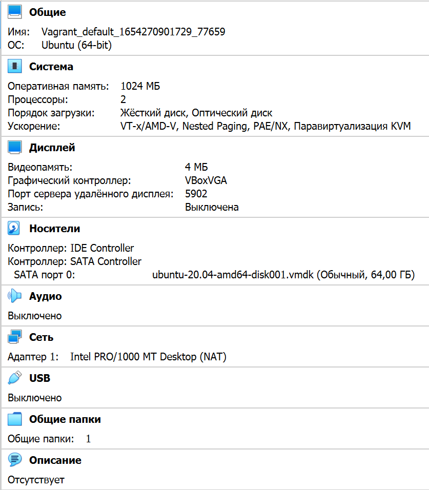

[Задание](https://github.com/netology-code/sysadm-homeworks/tree/devsys10/03-sysadmin-01-terminal)

5. По умолчанию выделено:



---
6.
   1. Для изменения к-ва выделяемой оперативной памяти и ядер процессора, необходимо добавить и указать требуемое к-во вместо `n1` и `n2` под строкой `config.vm.provider "virtualbox" do |v|`:
    ```
    v.memory = n1
    v.cpus = n2
    ```
   2. Для изменения выделяемых ресурсов процессора, необходимо добавить следующую строку в Vagranfile и указать требуемое к-во (в процентах) вместо `n` под строкой `config.vm.provider "virtualbox" do |v|`:
       ```
      v.customize ["modifyvm", :id, "--cpuexecutioncap", "n"]
      ```

---
8.
   1. line 862 - **HISTSIZE** (по умолчанию равен 500)
   2. **ignoreboth** - одно из возможных значений переменной *HISTCONTROL* - позволяет не записывать в историю команду, которая начинается с пробела, либо команду, которая дублирует предыдущую

---
9. 
   1. line 1091 - **Brace Expansion**. Также это одно из "зарезервированных слов"
   2. Это одно из семи расширений (expansion), позволяющее сокращать написание команды. Например, вместо `echo ade ace abe'` можно использовать конструкцуию `echo a{d,c,b}e`

---
10. 
    1. `touch file{0..100000}`
    2. 300000 файлов создать таким образом не получится из-за аргумента `ARG_MAX`. Однако так и не нашёл, как проверить, сколько файлов можно будет создать исходя из просмотра значения данного аргумента.

---
11. `[[` - это синоним команды test, в двух словах - проверяет и сравнивает переданные ей аргументы, а ]] - это аргумент, который приказывает прекратить проверять аргументы. `[[ -d /tmp ]]` Выводит 0 (правда), если файл */tmp* присутствует и является директорией

---
12. 
```
mkdir /tmp/new_path_directory
cp /bin/bash /tmp/new_path_directory/
PATH=/tmp/new_path_directory/:$PATH
```

---
13. 
    1. `at` - команда запустится в заданное время/день
    2. `batch` - команда запустится, когда среднее значение нагрузки упадёт ниже 1,5 (или значения, указанного при вызове atd)
---    
