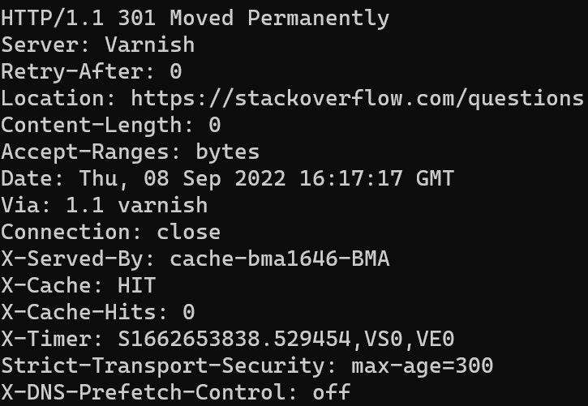
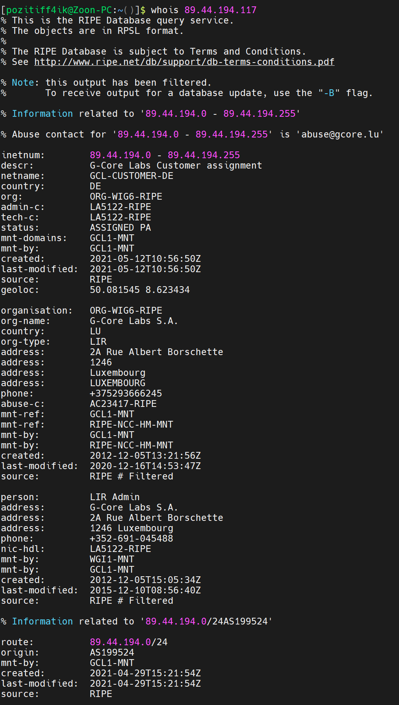
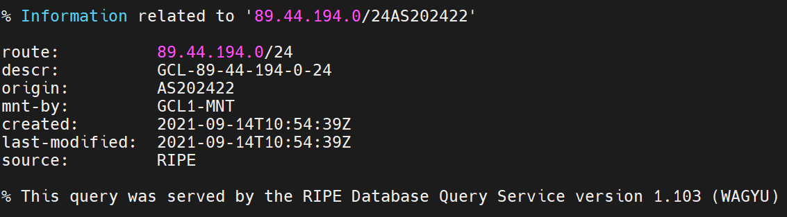
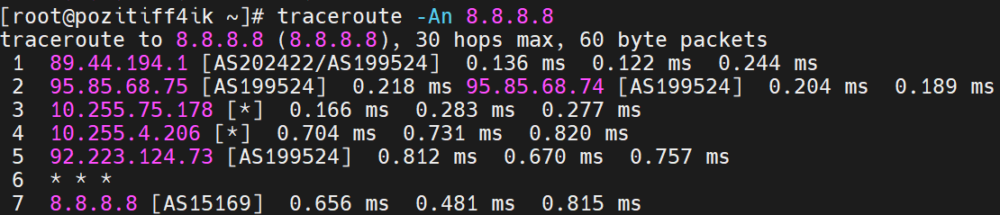
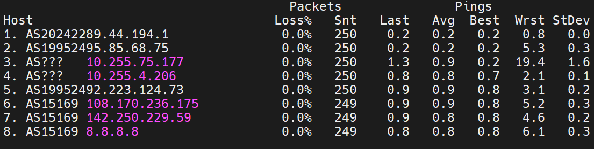
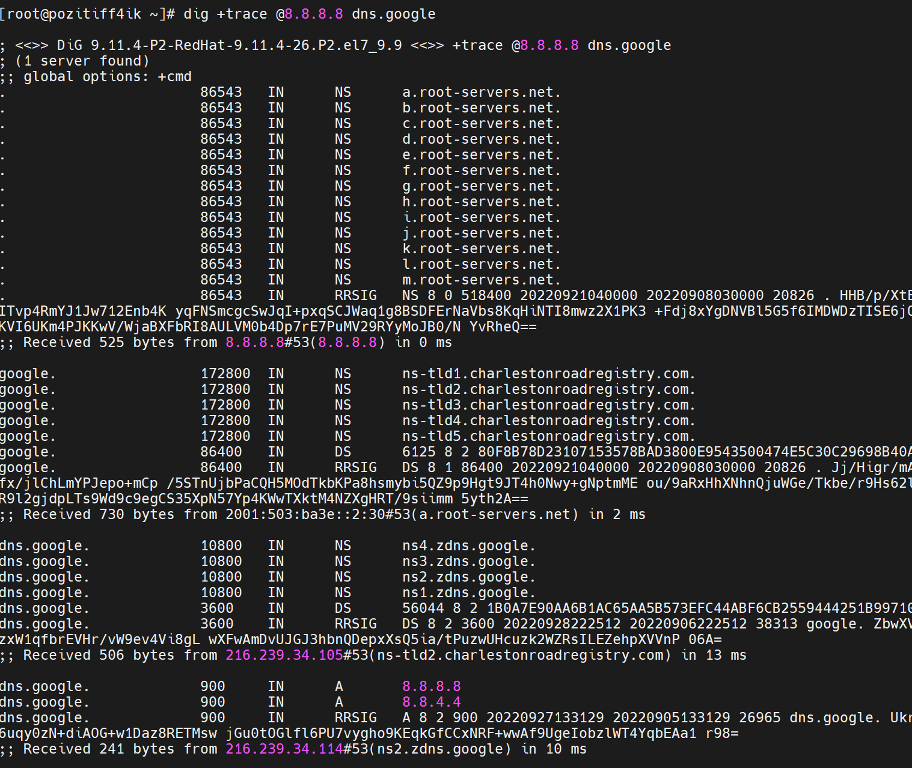
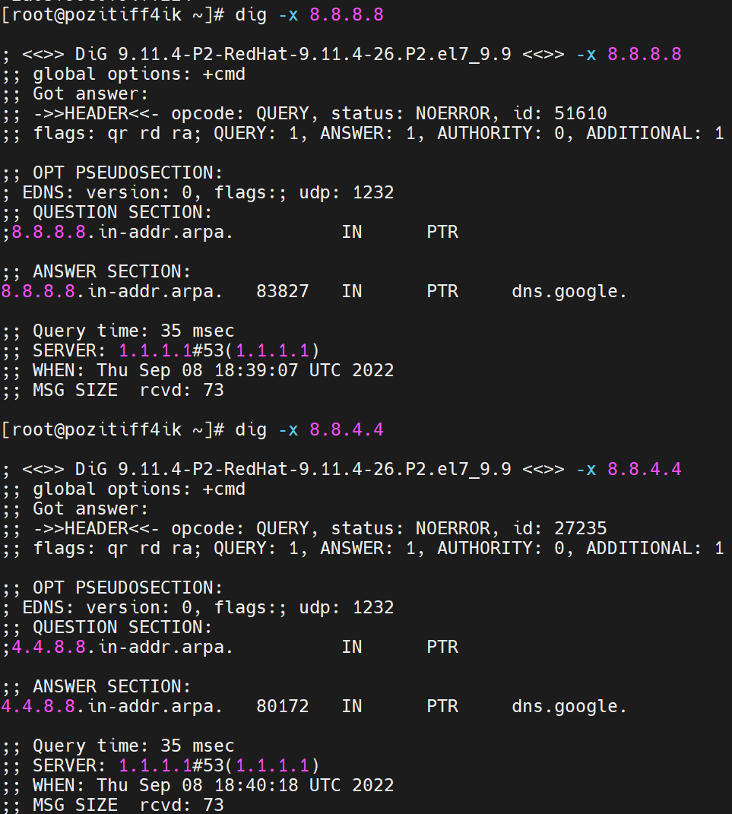

[Задание](https://github.com/netology-code/sysadm-homeworks/tree/devsys10/03-sysadmin-06-net/README.md)

---
##### 1. Работа c HTTP через телнет. 
HTTP/1.1 301 Moved Permanently:
> стандартный код ответа HTTP, получаемый в ответ от сервера в ситуации, когда запрошенный ресурс был на постоянной основе перемещён в новое месторасположение, и указывающий на то, что текущие ссылки, использующие данный URL, должны быть обновлены. Адрес нового месторасположения ресурса указывается в поле Location получаемого в ответ заголовка пакета протокола HTTP    

Адрес нового месторасположения: https://stackoverflow.com/questions

---
##### 2. Повторите задание 1 в браузере, используя консоль разработчика F12

- HTTP код: ***Status Code: 307 Internal Redirect***
- время загрузки страницы: ***Finish: 25.70 s***
- какой запрос обрабатывался дольше всего?
  - Request URL: https://stackoverflow.com/
  - Request Method: GET
- 

---
##### 3. Какой IP адрес у вас в интернете?
89.44.194.117

---
##### 4. Какому провайдеру принадлежит ваш IP адрес?
G-Core Labs Customer assignment

- Какой автономной системе AS?
  - origin:         AS199524
  - origin:         AS202422

---
##### 5. Через какие сети проходит пакет, отправленный с вашего компьютера на адрес 8.8.8.8? Через какие AS?

> traceroute to 8.8.8.8 (8.8.8.8), 30 hops max, 60 byte packets
> 
> 1  89.44.194.1 [AS202422/AS199524]  0.136 ms  0.122 ms  0.244 ms
> 
> 2  95.85.68.75 [AS199524]  0.218 ms 95.85.68.74 [AS199524]  0.204 ms  0.189 ms
> 
> 3  10.255.75.178 [*]  0.166 ms  0.283 ms  0.277 ms
> 
> 4  10.255.4.206 [*]  0.704 ms  0.731 ms  0.820 ms
> 
> 5  92.223.124.73 [AS199524]  0.812 ms  0.670 ms  0.757 ms
> 
> 6  * * *
> 
> 7  8.8.8.8 [AS15169]  0.656 ms  0.481 ms  0.815 ms

---
##### 6. Повторите задание 5 в утилите mtr. На каком участке наибольшая задержка - delay?

Наибольшая задержка:  3. AS??? 10.255.75.177 - 3.3мс

---
##### 7. Воспользуйтесь утилитой dig

- Какие DNS сервера отвечают за доменное имя dns.google?
  - ns4.zdns.google
  - ns3.zdns.google
  - ns2.zdns.google
  - ns1.zdns.google
- Какие A записи?
  - 8.8.8.8
  - 8.8.4.4

---
##### 8. Проверьте PTR записи для IP адресов из задания 7. Какое доменное имя привязано к IP?
dns.google.

