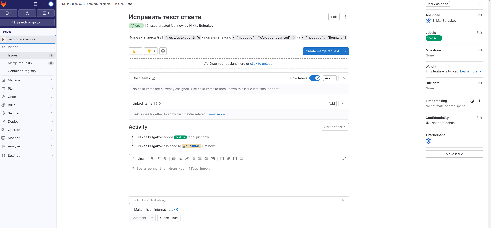
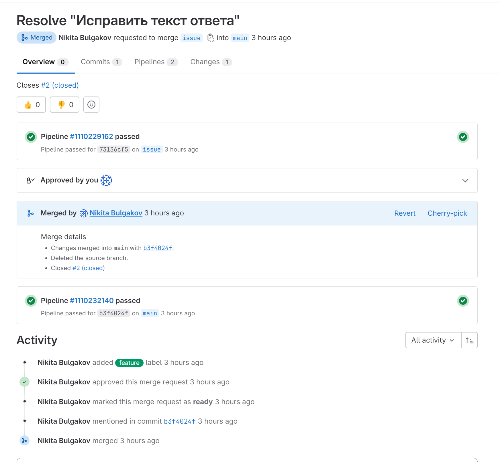

[Задание](https://github.com/netology-code/mnt-homeworks/blob/9b9f63e7688a78a0dc8683bf71ef7171933c9fab/09-ci-06-gitlab/README.md)

---

# Домашнее задание к занятию 12 «GitLab»

<details><summary>

## Подготовка к выполнению

</summary>

1. Или подготовьте к работе Managed GitLab от yandex cloud [по инструкции](https://cloud.yandex.ru/docs/managed-gitlab/operations/instance/instance-create) .
Или создайте виртуальную машину из публичного образа [по инструкции](https://cloud.yandex.ru/marketplace/products/yc/gitlab ) .
2. Создайте виртуальную машину и установите на нее gitlab runner, подключите к вашему серверу gitlab  [по инструкции](https://docs.gitlab.com/runner/install/linux-repository.html) .

3. (* Необязательное задание повышенной сложности. )  Если вы уже знакомы с k8s попробуйте выполнить задание, запустив gitlab server и gitlab runner в k8s  [по инструкции](https://cloud.yandex.ru/docs/tutorials/infrastructure-management/gitlab-containers). 

4. Создайте свой новый проект.
5. Создайте новый репозиторий в GitLab, наполните его [файлами](./repository).
6. Проект должен быть публичным, остальные настройки по желанию.

</details>

Для решения задач использовался gitlab.com

---

## Основная часть

<details><summary>

### DevOps

</summary>

В репозитории содержится код проекта на Python. Проект — RESTful API сервис. Ваша задача — автоматизировать сборку образа с выполнением python-скрипта:

1. Образ собирается на основе [centos:7](https://hub.docker.com/_/centos?tab=tags&page=1&ordering=last_updated).
2. Python версии не ниже 3.7.
3. Установлены зависимости: `flask` `flask-jsonpify` `flask-restful`.
4. Создана директория `/python_api`.
5. Скрипт из репозитория размещён в /python_api.
6. Точка вызова: запуск скрипта.
7. При комите в любую ветку должен собираться docker image с форматом имени hello:gitlab-$CI_COMMIT_SHORT_SHA . Образ должен быть выложен в Gitlab registry или yandex registry.   

</details>

**Решение:**

[Репозиторий на гитлабе](https://gitlab.com/p0zitiff4ik/netology-example)

<details><summary>gitlab-ci.yml</summary>

```yaml
stages:
    - build
    - deploy
image: docker:20.10.5
services:
    - docker:20.10.5-dind
builder:
    stage: build
    script:
        - docker build -t $CI_REGISTRY/$CI_PROJECT_PATH/hello:gitlab-$CI_COMMIT_SHORT_SHA .
    except:
        - main
deployer:
    stage: deploy
    script:
        - docker build -t $CI_REGISTRY/$CI_PROJECT_PATH/hello:gitlab-$CI_COMMIT_SHORT_SHA .
        - docker login -u $CI_REGISTRY_USER -p $CI_REGISTRY_PASSWORD $CI_REGISTRY
        - docker push $CI_REGISTRY/$CI_PROJECT_PATH/hello:gitlab-$CI_COMMIT_SHORT_SHA
    only:
        - main
```

</details>

<details><summary>Dockerfile</summary>

```Dockerfile
FROM centos:7
RUN yum -y install wget make gcc openssl-devel bzip2-devel libffi-devel zlib-devel xz-devel && \
    cd /usr/src/ && \
    wget https://www.python.org/ftp/python/3.7.11/Python-3.7.11.tgz && \
    tar xzf Python-3.7.11.tgz && \
    cd Python-3.7.11 && \
    ./configure --enable-optimizations && \
    make altinstall && \
    rm /usr/src/Python-3.7.11.tgz && \
    ln -sfn /usr/local/bin/python3.7 /usr/bin/python3 && \
    ln -sfn /usr/local/bin/pip3.7 /usr/bin/pip3 && \
    python3 -m pip install --upgrade pip
COPY requirements.txt requirements.txt
RUN pip3 install -r requirements.txt
COPY app.py /python_api/app.py
CMD ["python3", "/python_api/app.py"]
```

</details>

[Лог deploy job при коммите в main](https://gitlab.com/p0zitiff4ik/netology-example/-/jobs/5767511658)

[Лог build job при коммите в другую ветку](https://gitlab.com/p0zitiff4ik/netology-example/-/jobs/5767501775)

<details><summary>

### Product Owner

</summary>

Вашему проекту нужна бизнесовая доработка: нужно поменять JSON ответа на вызов метода GET `/rest/api/get_info`, необходимо создать Issue в котором указать:

1. Какой метод необходимо исправить.
2. Текст с `{ "message": "Already started" }` на `{ "message": "Running"}`.
3. Issue поставить label: feature.

</details>

**Решение:**



<details><summary>

### Developer

</summary>

Пришёл новый Issue на доработку, вам нужно:

1. Создать отдельную ветку, связанную с этим Issue.
2. Внести изменения по тексту из задания.
3. Подготовить Merge Request, влить необходимые изменения в `master`, проверить, что сборка прошла успешно.

</details>

**Решение:**

[Issue](https://gitlab.com/p0zitiff4ik/netology-example/-/issues/2)

<details><summary>Изменённый app.py:</summary>

```python
from flask import Flask, request
from flask_restful import Resource, Api
from json import dumps
from flask_jsonpify import jsonify

app = Flask(__name__)
api = Api(app)

class Info(Resource):
    def get(self):
        return {'version': 3, 'method': 'GET', 'message': 'Running'}

api.add_resource(Info, '/get_info')

if __name__ == '__main__':
     app.run(host='0.0.0.0', port='5290')
```

</details>

[Merge Request](https://gitlab.com/p0zitiff4ik/netology-example/-/merge_requests/6)



<details><summary>

### Tester

</summary>

Разработчики выполнили новый Issue, необходимо проверить валидность изменений:

1. Поднять докер-контейнер с образом `python-api:latest` и проверить возврат метода на корректность.
2. Закрыть Issue с комментарием об успешности прохождения, указав желаемый результат и фактически достигнутый.

</details>

**Решение:**

Видимо, предполагается локальное поднятие контейнера у себя, хотя это и немного странно. 
```shell
$ docker run -d --rm --name py-test -p 5290:5290 registry.gitlab.com/p0zitiff4ik/netology-example/hello:gitlab-d1ce67d2
```

```shell
$ curl http://127.0.0.1:5290/get_info
{"version": 3, "method": "GET", "message": "Running"}
```

[Issue](https://gitlab.com/p0zitiff4ik/netology-example/-/issues/2)

---
