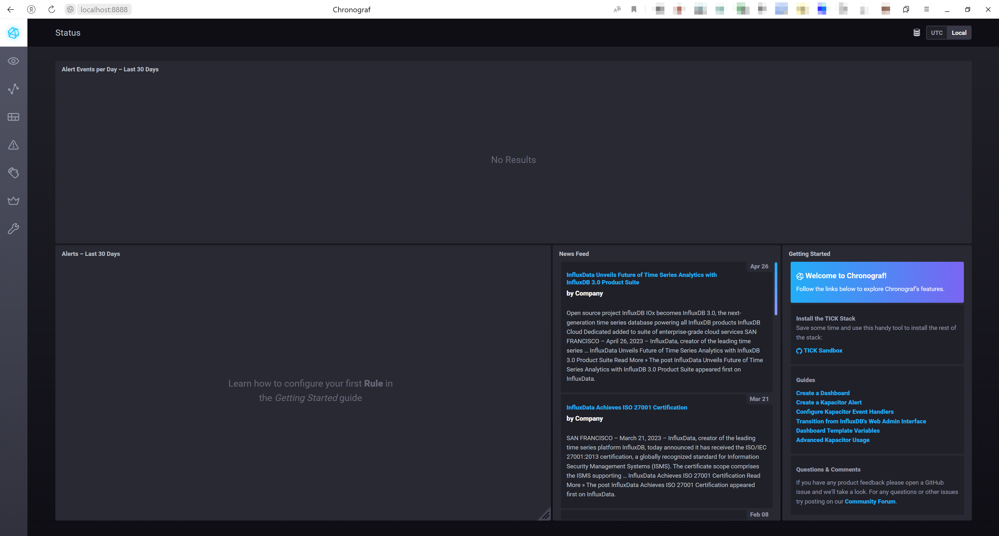
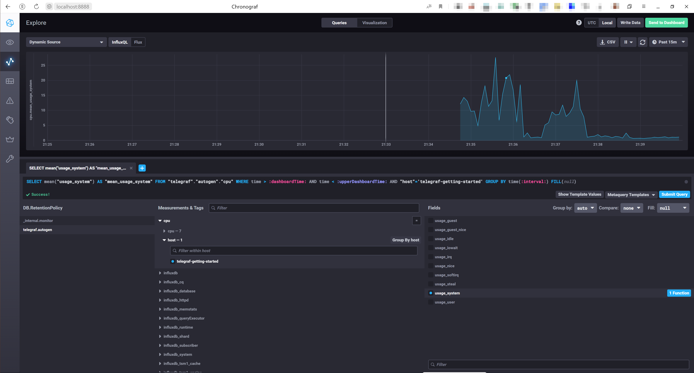
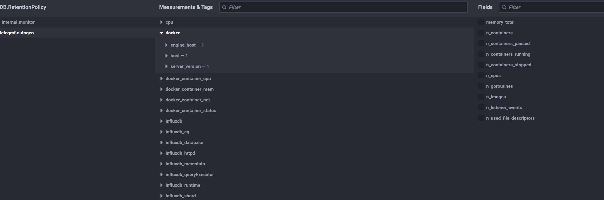

[Задание](https://github.com/netology-code/mnt-homeworks/blob/924aadf3fb1413056b466bd0c96c72d7106a723e/10-monitoring-02-systems/README.md)

---

# Домашнее задание к занятию "13.Системы мониторинга"

## Обязательные задания

1. Вас пригласили настроить мониторинг на проект. На онбординге вам рассказали, что проект представляет из себя платформу для вычислений с выдачей текстовых отчетов, которые сохраняются на диск. Взаимодействие с платформой осуществляется по протоколу http. Также вам отметили, что вычисления загружают ЦПУ. Какой минимальный набор метрик вы выведите в мониторинг и почему?

**Решение:**
Как минимум необходимо понимать, насколько сильно загружается ЦПУ и сколько места ещё осталось на диске - чтобы знать, справляется ли текущая инфраструктура или нет и нужна замена/модернизация. Также не лишним будет выводить метрики по трафику и скорости ответа, состоянии диска (-ов), скорости его заполнения. Можно дополнить метриками, собирающими информацию о том, какие конкретно процессы и насколько загружают ЦПУ и о выделенной оперативной памяти. Всё это для оценки распределения выделенных ресурсов и прогнозирования замены/модернизации железа (или масштабирования ресурсов, если облако). Ну или выделения не занятых ресурсов под другие нужды.
#
2. Менеджер продукта посмотрев на ваши метрики сказал, что ему непонятно что такое RAM/inodes/CPUla. Также он сказал, что хочет понимать, насколько мы выполняем свои обязанности перед клиентами и какое качество обслуживания. Что вы можете ему предложить?

**Решение:**
Можно ведь это всё визуализировать в той же Grafana и показывать уже красивые дашборды с обновляемыми графиками, к которым прикрутить описание метрик или просто сказать, что вот маленькие значения - хорошо, а большие - плохо (или наоборот) и надо что-то делать.
Для решения поставленной задачи необходимо будет объяснить такие понятия как SLO/SLA/SLI и настроить согласованные для SLO метрики и также выводить их на дашборды с возможностью выбора времени. К примеру, процент доступности сервиса (отдаваемые коды ответов), скорость ответа и, возможно, другие показатели, которые менеджер сочтёт необходимыми.
#
3. Вашей DevOps команде в этом году не выделили финансирование на построение системы сбора логов. Разработчики в свою очередь хотят видеть все ошибки, которые выдают их приложения. Какое решение вы можете предпринять в этой ситуации, чтобы разработчики получали ошибки приложения?

**Решение:**
Как вариант, попробовать использовать на имеющихся мощностях (если возможно) бесплатное или свободно распространяемое ПО:
 - [Sentry](https://sentry.io/welcome/)
 - [Yandex Cloud Logging](https://cloud.yandex.ru/services/logging)
 - [New Relic](https://newrelic.com/)
 - [Bugsnag](https://www.bugsnag.com/)
 - [Rollbar](https://rollbar.com/)
 - [Instabug](https://www.instabug.com/)

Если это невозможно - написать скрипты, которые бы опрашивали логи (которые разработчики конечно же не забыли прикрутить) пусть хотя бы grep'ом и передавали собранные ошибки каким-нибудь способом - по почте (предварительно настроив клиент) или копированием по scp.
#
4. Вы, как опытный SRE, сделали мониторинг, куда вывели отображения выполнения SLA=99% по http кодам ответов. Вычисляете этот параметр по следующей формуле: summ_2xx_requests/summ_all_requests. Данный параметр не поднимается выше 70%, но при этом в вашей системе нет кодов ответа 5xx и 4xx. Где у вас ошибка?

**Решение:**
Помимо кодов ответа 2xx, 4xx, 5xx есть также коды 1xx и 3xx, которые в формуле не учтены. Наверно, правильнее будет такая формула:
`(summ_all_requests-(summ_4xx_requests+summ_5xx_requests))/summ_all_requests`
#
5. Опишите основные плюсы и минусы pull и push систем мониторинга.

**Решение:**
> #### Push
>
> Плюсы:
> - Можно слать данные в несколько таргетов. Это может быть полезно не только для репликации, но и чтобы слать в разные контуры. Например, если на сервере несколько сервисов, не связанных друг с другом.
> - Работает за NAT.
> - Можно мониторить ноды без лишних алертов, если им не всегда нужно подключение к сети, или у них оно не всегда есть, например какие-то мобильные ноды, или при инвентаризации рабочих станций, которые включают/выключают постоянно.
> - Можно получить данные с хостов, с которых мы их изначально не ждали. То есть, при вводе новой ноды в эксплуатацию, нужно настроить только ноду, сервер настраивать не нужно.
> - В основном используется UDP протокол, который позволит сэкономить ресурсы при их нехватке.
> 
> Минусы:
> - Агенты могут зафлудить сервера запросами и устроить ему DDoS.
> - Требует открытия порта сервера во вне, что может создать проблемы со службой безопасности и безопасности в принципе.
> - Могут приходить данные, которые нам не нужны, т.е. сервер не контролирует ничего: частоту отправки данных, объём и т.д. 
> - При пересылке по UDP не гарантируется целостность пакетов.

> #### Pull
> 
> Плюсы
> - Нет требует открытия порта сервера во вне. При этом, порт должен быть открыт на клиенте, но с точки зрения безопасности это предпочтительней.
> - Подойдёт в ситуации, когда с ноды могут запрашивать данные разные сервисы, каждому из которых нужны свои данные.
> - Сервер тянет данные с агентов когда может, и если сейчас нет свободных ресурсов - заберёт данные позже.
> - Сервер сам определяет, в каком объёме нужны данные.
> - Проще защитить трафик, т.к. часто используется HTTP/S.
> - TCP гарантирует доставку пакетов
> 
> Минусы:
> - Не работает за NAT без дополнительных средств.
> - Менее производительный, более ресурсоёмкий, т.к. данные забираются по HTTP/S в основном.

#
6. Какие из ниже перечисленных систем относятся к push модели, а какие к pull? А может есть гибридные?

**Решение:**
| Система         | Модель                          |
| --------------- | ------------------------------- |
| Prometheus      | Pull (Push с Pushgateway)       |
| TICK            | Push                            |
| Zabbix          | Push (Pull с Zabbix Proxy)      |
| VictoriaMetrics | Push/Pull, зависит от источника |
| Nagios          | Pull                            |
#
7. Склонируйте себе [репозиторий](https://github.com/influxdata/sandbox/tree/master) и запустите TICK-стэк, 
используя технологии docker и docker-compose.

В виде решения на это упражнение приведите скриншот веб-интерфейса ПО chronograf (`http://localhost:8888`). 

P.S.: если при запуске некоторые контейнеры будут падать с ошибкой - проставьте им режим `Z`, например
`./data:/var/lib:Z`

**Решение:**

#
8. Перейдите в веб-интерфейс Chronograf (http://localhost:8888) и откройте вкладку Data explorer.
        
    - Нажмите на кнопку Add a query
    - Изучите вывод интерфейса и выберите БД telegraf.autogen
    - В `measurments` выберите cpu->host->telegraf-getting-started, а в `fields` выберите usage_system. Внизу появится график утилизации cpu.
    - Вверху вы можете увидеть запрос, аналогичный SQL-синтаксису. Поэкспериментируйте с запросом, попробуйте изменить группировку и интервал наблюдений.

Для выполнения задания приведите скриншот с отображением метрик утилизации cpu из веб-интерфейса.

**Решение:**

#
9. Изучите список [telegraf inputs](https://github.com/influxdata/telegraf/tree/master/plugins/inputs). 
Добавьте в конфигурацию telegraf следующий плагин - [docker](https://github.com/influxdata/telegraf/tree/master/plugins/inputs/docker):
```
[[inputs.docker]]
  endpoint = "unix:///var/run/docker.sock"
```

Дополнительно вам может потребоваться донастройка контейнера telegraf в `docker-compose.yml` дополнительного volume и 
режима privileged:
```
  telegraf:
    image: telegraf:1.4.0
    privileged: true
    volumes:
      - ./etc/telegraf.conf:/etc/telegraf/telegraf.conf:Z
      - /var/run/docker.sock:/var/run/docker.sock:Z
    links:
      - influxdb
    ports:
      - "8092:8092/udp"
      - "8094:8094"
      - "8125:8125/udp"
```

После настройке перезапустите telegraf, обновите веб интерфейс и приведите скриншотом список `measurments` в 
веб-интерфейсе базы telegraf.autogen . Там должны появиться метрики, связанные с docker.

Факультативно можете изучить какие метрики собирает telegraf после выполнения данного задания.

**Решение:**
Ничего добавлять не пришлось, так как плагин уже встроен в последней версии sandbox, кроме одной строчки `user: telegraf:120` на основании [Issue](https://github.com/influxdata/telegraf/issues/10050)


---

<details><summary>

## Дополнительное задание (со звездочкой*) - необязательно к выполнению

</summary>

1. Вы устроились на работу в стартап. На данный момент у вас нет возможности развернуть полноценную систему 
мониторинга, и вы решили самостоятельно написать простой python3-скрипт для сбора основных метрик сервера. Вы, как 
опытный системный-администратор, знаете, что системная информация сервера лежит в директории `/proc`. 
Также, вы знаете, что в системе Linux есть  планировщик задач cron, который может запускать задачи по расписанию.

Суммировав все, вы спроектировали приложение, которое:
- является python3 скриптом
- собирает метрики из папки `/proc`
- складывает метрики в файл 'YY-MM-DD-awesome-monitoring.log' в директорию /var/log 
(YY - год, MM - месяц, DD - день)
- каждый сбор метрик складывается в виде json-строки, в виде:
  + timestamp (временная метка, int, unixtimestamp)
  + metric_1 (метрика 1)
  + metric_2 (метрика 2)
  
     ...
     
  + metric_N (метрика N)
  
- сбор метрик происходит каждую 1 минуту по cron-расписанию

Для успешного выполнения задания нужно привести:

а) работающий код python3-скрипта,

б) конфигурацию cron-расписания,

в) пример верно сформированного 'YY-MM-DD-awesome-monitoring.log', имеющий не менее 5 записей,

P.S.: количество собираемых метрик должно быть не менее 4-х.
P.P.S.: по желанию можно себя не ограничивать только сбором метрик из `/proc`.

2. В веб-интерфейсе откройте вкладку `Dashboards`. Попробуйте создать свой dashboard с отображением:

    - утилизации ЦПУ
    - количества использованного RAM
    - утилизации пространства на дисках
    - количество поднятых контейнеров
    - аптайм
    - ...
    - фантазируйте)
    
    ---

</details>

---
