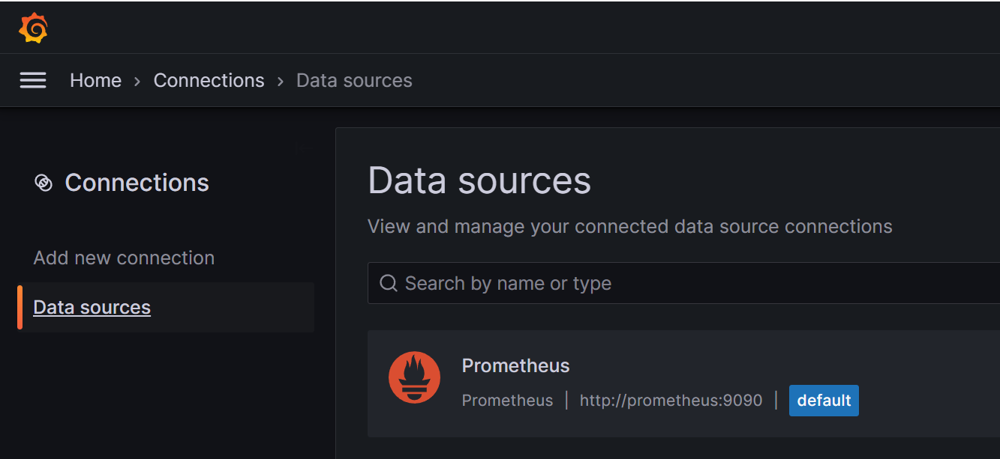
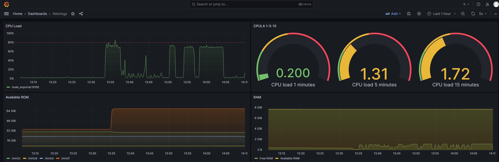

[Задание](https://github.com/netology-code/mnt-homeworks/blob/4df263a46e5f2a05d6c45e92cb261c8c0843460b/10-monitoring-03-grafana/README.md)

---

# Домашнее задание к занятию 14 «Средство визуализации Grafana»

<details><summary>

## Задание повышенной сложности

</summary>


**При решении задания 1** не используйте директорию [help](./help) для сборки проекта. Самостоятельно разверните grafana, где в роли источника данных будет выступать prometheus, а сборщиком данных будет node-exporter:

- grafana;
- prometheus-server;
- prometheus node-exporter.

За дополнительными материалами можете обратиться в официальную документацию grafana и prometheus.

В решении к домашнему заданию также приведите все конфигурации, скрипты, манифесты, которые вы 
использовали в процессе решения задания.

**При решении задания 3** вы должны самостоятельно завести удобный для вас канал нотификации, например, Telegram или email, и отправить туда тестовые события.

В решении приведите скриншоты тестовых событий из каналов нотификаций.

</details>

## Обязательные задания

### Задание 1

> 1. Используя директорию [help](./help) внутри этого домашнего задания, запустите связку prometheus-grafana.
> 1. Зайдите в веб-интерфейс grafana, используя авторизационные данные, указанные в манифесте docker-compose.
> 1. Подключите поднятый вами prometheus, как источник данных.
> 1. Решение домашнего задания — скриншот веб-интерфейса grafana со списком подключенных Datasource.

**Решение:**



## Задание 2

> Изучите самостоятельно ресурсы:
> 
> 1. [PromQL tutorial for beginners and humans](https://valyala.medium.com/promql-tutorial-for-beginners-9ab455142085).
> 1. [Understanding Machine CPU usage](https://www.robustperception.io/understanding-machine-cpu-usage).
> 1. [Introduction to PromQL, the Prometheus query language](https://grafana.com/blog/2020/02/04/introduction-to-promql-the-prometheus-query-language/).
> 
> Создайте Dashboard и в ней создайте Panels:
> 
> - утилизация CPU для nodeexporter (в процентах, 100-idle);
> - CPULA 1/5/15;
> - количество свободной оперативной памяти;
> - количество места на файловой системе.
> 
> Для решения этого задания приведите promql-запросы для выдачи этих метрик, а также скриншот получившейся Dashboard.

**Решение:**
В указанной в `help` версии была проблема, которую исправили в версии 9.1.4: https://community.grafana.com/t/parse-error-at-char-4-unexpected-character-ufeff/40704/7.
Поставил последние версии стека.

Утилизация CPU:
```promql
100 - (avg by(instance) (irate(node_cpu_seconds_total{mode="idle"}[$__rate_interval])) * 100)
```

CPULA:
```promql
node_load1{instance="node_exporter:9100"}
node_load5{instance="node_exporter:9100"}
node_load15{instance="node_exporter:9100"}
```

Свободная ОЗУ:
Тут решил немного отойти от условия и для наглядности добавить ещё и к-во ОЗУ всего
```promql
node_memory_MemFree_bytes{instance="node_exporter:9100"}
node_memory_MemTotal_bytes{instance="node_exporter:9100"}
```

Оставшееся место на ФС:
Опять же, для наглядности разделил по `mountpoint`, а поскольку используется Windows11 с WSL2, пришлось ограничить выбор реально подключенными дисками
```promql
sum by(mountpoint) (node_filesystem_avail_bytes{mountpoint=~"/mnt/c|/mnt/d|/mnt/e|/mnt/f"})
```



## Задание 3

1. Создайте для каждой Dashboard подходящее правило alert — можно обратиться к первой лекции в блоке «Мониторинг».
1. В качестве решения задания приведите скриншот вашей итоговой Dashboard.

## Задание 4

1. Сохраните ваш Dashboard.Для этого перейдите в настройки Dashboard, выберите в боковом меню «JSON MODEL». Далее скопируйте отображаемое json-содержимое в отдельный файл и сохраните его.
1. В качестве решения задания приведите листинг этого файла.

---
