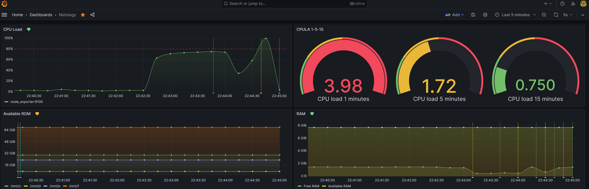

[Задание](https://github.com/netology-code/mnt-homeworks/blob/4df263a46e5f2a05d6c45e92cb261c8c0843460b/10-monitoring-03-grafana/README.md)

---

# Домашнее задание к занятию 14 «Средство визуализации Grafana»

<details><summary>

## Задание повышенной сложности

</summary>

**При решении задания 1** не используйте директорию [help](./help) для сборки проекта. Самостоятельно разверните grafana, где в роли источника данных будет выступать prometheus, а сборщиком данных будет node-exporter:

- grafana;
- prometheus-server;
- prometheus node-exporter.

За дополнительными материалами можете обратиться в официальную документацию grafana и prometheus.

В решении к домашнему заданию также приведите все конфигурации, скрипты, манифесты, которые вы 
использовали в процессе решения задания.

**При решении задания 3** вы должны самостоятельно завести удобный для вас канал нотификации, например, Telegram или email, и отправить туда тестовые события.

В решении приведите скриншоты тестовых событий из каналов нотификаций.

</details>

## Обязательные задания

### Задание 1

> 1. Используя директорию [help](./help) внутри этого домашнего задания, запустите связку prometheus-grafana.
> 1. Зайдите в веб-интерфейс grafana, используя авторизационные данные, указанные в манифесте docker-compose.
> 1. Подключите поднятый вами prometheus, как источник данных.
> 1. Решение домашнего задания — скриншот веб-интерфейса grafana со списком подключенных Datasource.

**Решение:**


## Задание 2

> Изучите самостоятельно ресурсы:
> 
> 1. [PromQL tutorial for beginners and humans](https://valyala.medium.com/promql-tutorial-for-beginners-9ab455142085).
> 1. [Understanding Machine CPU usage](https://www.robustperception.io/understanding-machine-cpu-usage).
> 1. [Introduction to PromQL, the Prometheus query language](https://grafana.com/blog/2020/02/04/introduction-to-promql-the-prometheus-query-language/).
> 
> Создайте Dashboard и в ней создайте Panels:
> 
> - утилизация CPU для nodeexporter (в процентах, 100-idle);
> - CPULA 1/5/15;
> - количество свободной оперативной памяти;
> - количество места на файловой системе.
> 
> Для решения этого задания приведите promql-запросы для выдачи этих метрик, а также скриншот получившейся Dashboard.

**Решение:**

В указанной в `help` версии была проблема, которую исправили в версии 9.1.4: https://community.grafana.com/t/parse-error-at-char-4-unexpected-character-ufeff/40704/7.
Поставил последние версии стека.

_Утилизация CPU:_

```promql
100 - (avg by(instance) (irate(node_cpu_seconds_total{mode="idle"}[$__rate_interval])) * 100)
```

_CPULA:_
```promql
node_load1{instance="node_exporter:9100"}
node_load5{instance="node_exporter:9100"}
node_load15{instance="node_exporter:9100"}
```

_Свободная ОЗУ:_
    
Тут решил немного отойти от условия и для наглядности добавить ещё и к-во ОЗУ всего
```promql
node_memory_MemFree_bytes{instance="node_exporter:9100"}
node_memory_MemTotal_bytes{instance="node_exporter:9100"}
```

_Оставшееся место на ФС:_

Опять же, для наглядности разделил по `mountpoint`, а поскольку используется Windows11 с WSL2, пришлось ограничить выбор реально подключенными дисками
```promql
sum by(mountpoint) (node_filesystem_avail_bytes{mountpoint=~"/mnt/c|/mnt/d|/mnt/e|/mnt/f"})
```


## Задание 3

> 1. Создайте для каждой Dashboard подходящее правило alert — можно обратиться к первой лекции в блоке «Мониторинг».
> 1. В качестве решения задания приведите скриншот вашей итоговой Dashboard.

**Решение:**

Скриншот дашборда с алертами:



Скриншот Alert rules:


Скриншот сработавшего алерта на к-во свободной памяти <10% в Grafana:


Скриншот алерта от настроенного бота:


## Задание 4

> 1. Сохраните ваш Dashboard.Для этого перейдите в настройки Dashboard, выберите в боковом меню «JSON MODEL». Далее скопируйте отображаемое json-содержимое в отдельный файл и сохраните его.
> 1. В качестве решения задания приведите листинг этого файла.

**Решение:**

<details><summary>

json дашборда

</summary>

```json
{
  "__inputs": [
    {
      "name": "DS_PROMETHEUS",
      "label": "Prometheus",
      "description": "",
      "type": "datasource",
      "pluginId": "prometheus",
      "pluginName": "Prometheus"
    }
  ],
  "__elements": {},
  "__requires": [
    {
      "type": "panel",
      "id": "gauge",
      "name": "Gauge",
      "version": ""
    },
    {
      "type": "grafana",
      "id": "grafana",
      "name": "Grafana",
      "version": "10.2.3"
    },
    {
      "type": "datasource",
      "id": "prometheus",
      "name": "Prometheus",
      "version": "1.0.0"
    },
    {
      "type": "panel",
      "id": "timeseries",
      "name": "Time series",
      "version": ""
    }
  ],
  "annotations": {
    "list": [
      {
        "builtIn": 1,
        "datasource": {
          "type": "grafana",
          "uid": "-- Grafana --"
        },
        "enable": true,
        "hide": true,
        "iconColor": "rgba(0, 211, 255, 1)",
        "name": "Annotations & Alerts",
        "type": "dashboard"
      }
    ]
  },
  "editable": true,
  "fiscalYearStartMonth": 0,
  "graphTooltip": 0,
  "id": null,
  "links": [],
  "liveNow": false,
  "panels": [
    {
      "datasource": {
        "type": "prometheus",
        "uid": "${DS_PROMETHEUS}"
      },
      "fieldConfig": {
        "defaults": {
          "color": {
            "mode": "palette-classic"
          },
          "custom": {
            "axisBorderShow": false,
            "axisCenteredZero": false,
            "axisColorMode": "text",
            "axisLabel": "",
            "axisPlacement": "auto",
            "axisSoftMax": 100,
            "axisSoftMin": 0,
            "barAlignment": 0,
            "drawStyle": "line",
            "fillOpacity": 15,
            "gradientMode": "opacity",
            "hideFrom": {
              "legend": false,
              "tooltip": false,
              "viz": false
            },
            "insertNulls": false,
            "lineInterpolation": "smooth",
            "lineWidth": 1,
            "pointSize": 5,
            "scaleDistribution": {
              "type": "linear"
            },
            "showPoints": "auto",
            "spanNulls": false,
            "stacking": {
              "group": "A",
              "mode": "none"
            },
            "thresholdsStyle": {
              "mode": "dashed"
            }
          },
          "mappings": [],
          "thresholds": {
            "mode": "percentage",
            "steps": [
              {
                "color": "green",
                "value": null
              },
              {
                "color": "red",
                "value": 80
              }
            ]
          },
          "unit": "percent"
        },
        "overrides": []
      },
      "gridPos": {
        "h": 8,
        "w": 12,
        "x": 0,
        "y": 0
      },
      "id": 1,
      "options": {
        "legend": {
          "calcs": [],
          "displayMode": "list",
          "placement": "bottom",
          "showLegend": true
        },
        "tooltip": {
          "mode": "single",
          "sort": "none"
        }
      },
      "targets": [
        {
          "datasource": {
            "type": "prometheus",
            "uid": "${DS_PROMETHEUS}"
          },
          "disableTextWrap": false,
          "editorMode": "code",
          "exemplar": false,
          "expr": "100 - (avg by(instance) (irate(node_cpu_seconds_total{mode=\"idle\"}[$__rate_interval])) * 100)",
          "fullMetaSearch": false,
          "includeNullMetadata": false,
          "instant": false,
          "legendFormat": "__auto",
          "range": true,
          "refId": "A",
          "useBackend": false
        }
      ],
      "title": "CPU Load",
      "type": "timeseries"
    },
    {
      "datasource": {
        "type": "prometheus",
        "uid": "${DS_PROMETHEUS}"
      },
      "fieldConfig": {
        "defaults": {
          "color": {
            "mode": "thresholds"
          },
          "mappings": [],
          "thresholds": {
            "mode": "absolute",
            "steps": [
              {
                "color": "green",
                "value": null
              },
              {
                "color": "#EAB839",
                "value": 1
              },
              {
                "color": "red",
                "value": 2
              }
            ]
          }
        },
        "overrides": []
      },
      "gridPos": {
        "h": 8,
        "w": 12,
        "x": 12,
        "y": 0
      },
      "id": 2,
      "options": {
        "minVizHeight": 200,
        "minVizWidth": 200,
        "orientation": "auto",
        "reduceOptions": {
          "calcs": [
            "lastNotNull"
          ],
          "fields": "",
          "values": false
        },
        "showThresholdLabels": false,
        "showThresholdMarkers": true,
        "sizing": "auto"
      },
      "pluginVersion": "10.2.3",
      "targets": [
        {
          "datasource": {
            "type": "prometheus",
            "uid": "${DS_PROMETHEUS}"
          },
          "disableTextWrap": false,
          "editorMode": "builder",
          "expr": "node_load1{instance=\"node_exporter:9100\"}",
          "fullMetaSearch": false,
          "includeNullMetadata": true,
          "instant": false,
          "legendFormat": "CPU load 1 minutes",
          "range": true,
          "refId": "A",
          "useBackend": false
        },
        {
          "datasource": {
            "type": "prometheus",
            "uid": "${DS_PROMETHEUS}"
          },
          "disableTextWrap": false,
          "editorMode": "builder",
          "expr": "node_load5{instance=\"node_exporter:9100\"}",
          "fullMetaSearch": false,
          "hide": false,
          "includeNullMetadata": true,
          "instant": false,
          "legendFormat": "CPU load 5 minutes",
          "range": true,
          "refId": "B",
          "useBackend": false
        },
        {
          "datasource": {
            "type": "prometheus",
            "uid": "${DS_PROMETHEUS}"
          },
          "disableTextWrap": false,
          "editorMode": "builder",
          "expr": "node_load15{instance=\"node_exporter:9100\"}",
          "fullMetaSearch": false,
          "hide": false,
          "includeNullMetadata": true,
          "instant": false,
          "legendFormat": "CPU load 15 minutes",
          "range": true,
          "refId": "C",
          "useBackend": false
        }
      ],
      "title": "CPULA 1-5-15",
      "type": "gauge"
    },
    {
      "datasource": {
        "type": "prometheus",
        "uid": "${DS_PROMETHEUS}"
      },
      "fieldConfig": {
        "defaults": {
          "color": {
            "mode": "palette-classic"
          },
          "custom": {
            "axisBorderShow": false,
            "axisCenteredZero": false,
            "axisColorMode": "text",
            "axisLabel": "",
            "axisPlacement": "auto",
            "barAlignment": 0,
            "drawStyle": "line",
            "fillOpacity": 22,
            "gradientMode": "opacity",
            "hideFrom": {
              "legend": false,
              "tooltip": false,
              "viz": false
            },
            "insertNulls": false,
            "lineInterpolation": "smooth",
            "lineWidth": 1,
            "pointSize": 5,
            "scaleDistribution": {
              "type": "linear"
            },
            "showPoints": "auto",
            "spanNulls": false,
            "stacking": {
              "group": "A",
              "mode": "none"
            },
            "thresholdsStyle": {
              "mode": "off"
            }
          },
          "mappings": [],
          "thresholds": {
            "mode": "absolute",
            "steps": [
              {
                "color": "green",
                "value": null
              },
              {
                "color": "red",
                "value": 80
              }
            ]
          },
          "unit": "bytes"
        },
        "overrides": []
      },
      "gridPos": {
        "h": 8,
        "w": 12,
        "x": 0,
        "y": 8
      },
      "id": 4,
      "options": {
        "legend": {
          "calcs": [],
          "displayMode": "list",
          "placement": "bottom",
          "showLegend": true
        },
        "tooltip": {
          "mode": "single",
          "sort": "none"
        }
      },
      "targets": [
        {
          "datasource": {
            "type": "prometheus",
            "uid": "${DS_PROMETHEUS}"
          },
          "disableTextWrap": false,
          "editorMode": "builder",
          "expr": "sum by(mountpoint) (node_filesystem_avail_bytes{mountpoint=~\"/mnt/c|/mnt/d|/mnt/e|/mnt/f\"})",
          "fullMetaSearch": false,
          "includeNullMetadata": true,
          "instant": false,
          "legendFormat": "{{label_name}}",
          "range": true,
          "refId": "A",
          "useBackend": false
        }
      ],
      "title": "Available ROM",
      "type": "timeseries"
    },
    {
      "datasource": {
        "type": "prometheus",
        "uid": "${DS_PROMETHEUS}"
      },
      "fieldConfig": {
        "defaults": {
          "color": {
            "mode": "palette-classic"
          },
          "custom": {
            "axisBorderShow": false,
            "axisCenteredZero": false,
            "axisColorMode": "text",
            "axisLabel": "",
            "axisPlacement": "auto",
            "barAlignment": 0,
            "drawStyle": "line",
            "fillOpacity": 20,
            "gradientMode": "hue",
            "hideFrom": {
              "legend": false,
              "tooltip": false,
              "viz": false
            },
            "insertNulls": false,
            "lineInterpolation": "smooth",
            "lineWidth": 1,
            "pointSize": 5,
            "scaleDistribution": {
              "type": "linear"
            },
            "showPoints": "auto",
            "spanNulls": false,
            "stacking": {
              "group": "A",
              "mode": "none"
            },
            "thresholdsStyle": {
              "mode": "off"
            }
          },
          "mappings": [],
          "thresholds": {
            "mode": "absolute",
            "steps": [
              {
                "color": "green",
                "value": null
              },
              {
                "color": "red",
                "value": 80
              }
            ]
          },
          "unit": "bytes"
        },
        "overrides": []
      },
      "gridPos": {
        "h": 8,
        "w": 12,
        "x": 12,
        "y": 8
      },
      "id": 3,
      "options": {
        "legend": {
          "calcs": [],
          "displayMode": "list",
          "placement": "bottom",
          "showLegend": true
        },
        "tooltip": {
          "mode": "single",
          "sort": "none"
        }
      },
      "targets": [
        {
          "datasource": {
            "type": "prometheus",
            "uid": "${DS_PROMETHEUS}"
          },
          "disableTextWrap": false,
          "editorMode": "builder",
          "expr": "node_memory_MemFree_bytes{instance=\"node_exporter:9100\"}",
          "fullMetaSearch": false,
          "includeNullMetadata": true,
          "instant": false,
          "legendFormat": "Free RAM",
          "range": true,
          "refId": "A",
          "useBackend": false
        },
        {
          "datasource": {
            "type": "prometheus",
            "uid": "${DS_PROMETHEUS}"
          },
          "disableTextWrap": false,
          "editorMode": "builder",
          "expr": "node_memory_MemTotal_bytes{instance=\"node_exporter:9100\"}",
          "fullMetaSearch": false,
          "hide": false,
          "includeNullMetadata": true,
          "instant": false,
          "legendFormat": "Available RAM",
          "range": true,
          "refId": "B",
          "useBackend": false
        }
      ],
      "title": "RAM",
      "type": "timeseries"
    }
  ],
  "refresh": "5s",
  "schemaVersion": 39,
  "tags": [],
  "templating": {
    "list": []
  },
  "time": {
    "from": "now-5m",
    "to": "now"
  },
  "timepicker": {},
  "timezone": "",
  "title": "Netology",
  "uid": "c32df5b3-2640-4d72-9f29-92495c4d5fbc",
  "version": 6,
  "weekStart": ""
}
```

</details>

---
