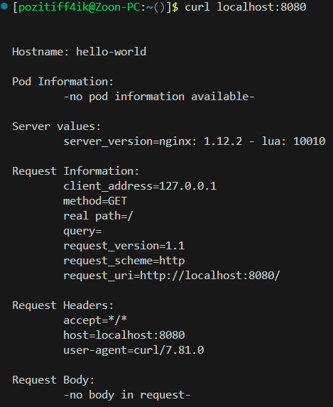
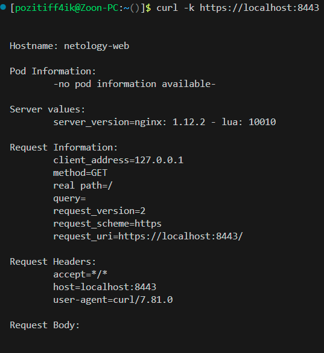

# Домашнее задание к занятию «Базовые объекты K8S»

## [Задание](https://github.com/netology-code/kuber-homeworks/blob/1251f3685694d0e28a985cf4464ef8b94e9ccc09/1.2/1.2.md)

### Цель задания

В тестовой среде для работы с Kubernetes, установленной в предыдущем ДЗ, необходимо развернуть Pod с приложением и подключиться к нему со своего локального компьютера. 

<details><summary>

### Описание

</summary>

### Задание 1. Создать Pod с именем hello-world

1. Создать манифест (yaml-конфигурацию) Pod.
2. Использовать image - gcr.io/kubernetes-e2e-test-images/echoserver:2.2.
3. Подключиться локально к Pod с помощью `kubectl port-forward` и вывести значение (curl или в браузере).

------

### Задание 2. Создать Service и подключить его к Pod

1. Создать Pod с именем netology-web.
2. Использовать image — gcr.io/kubernetes-e2e-test-images/echoserver:2.2.
3. Создать Service с именем netology-svc и подключить к netology-web.
4. Подключиться локально к Service с помощью `kubectl port-forward` и вывести значение (curl или в браузере).

</details>

------

## Решение

- `hello-world` pod:
> 

- `netology-svc` service:
> 

- `kubectl get pods`:
```commandline
[pozitiff4ik@Zoon-PC:~()]$ kubectl get pods
NAME           READY   STATUS    RESTARTS      AGE
hello-world    1/1     Running   2 (58m ago)   12h
netology-web   1/1     Running   0             13m
nginx          1/1     Running   2 (58m ago)   13h
```

- Манифесты:
  - [hello-world.yaml](kube_manifests/pod/hello-world.yaml)
  - [netology-web.yaml](kube_manifests/pod/netology-web.yaml)
  - [netology-svc.yaml](kube_manifests/svc/netology-svc.yaml)