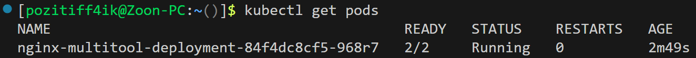
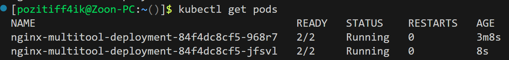
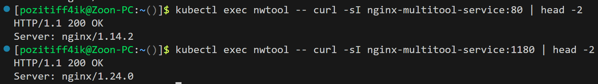
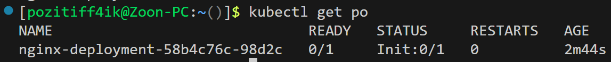
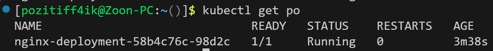

# Домашнее задание к занятию «Запуск приложений в K8S»

## [Задание](https://github.com/netology-code/kuber-homeworks/blob/1251f3685694d0e28a985cf4464ef8b94e9ccc09/1.3/1.3.md)

### Описание

------

### Задание 1. Создать Deployment и обеспечить доступ к репликам приложения из другого Pod

1. Создать Deployment приложения, состоящего из двух контейнеров — nginx и multitool. Решить возникшую ошибку.
2. После запуска увеличить количество реплик работающего приложения до 2.
3. Продемонстрировать количество подов до и после масштабирования.
4. Создать Service, который обеспечит доступ до реплик приложений из п.1.
5. Создать отдельный Pod с приложением multitool и убедиться с помощью `curl`, что из пода есть доступ до приложений из п.1.

------

### Задание 2. Создать Deployment и обеспечить старт основного контейнера при выполнении условий

1. Создать Deployment приложения nginx и обеспечить старт контейнера только после того, как будет запущен сервис этого приложения.
2. Убедиться, что nginx не стартует. В качестве Init-контейнера взять busybox.
3. Создать и запустить Service. Убедиться, что Init запустился.
4. Продемонстрировать состояние пода до и после запуска сервиса.

------

### Правила приема работы

1. Домашняя работа оформляется в своем Git-репозитории в файле README.md. Выполненное домашнее задание пришлите ссылкой на .md-файл в вашем репозитории.
2. Файл README.md должен содержать скриншоты вывода необходимых команд `kubectl` и скриншоты результатов.
3. Репозиторий должен содержать файлы манифестов и ссылки на них в файле README.md.

---

## Решение

### Задание 1

До масштабирования:
> 

После масштабирования:
> 

Приложения доступны:
> 

P.S. Проблема с портами была решена прописыванием переменных окружения, см. [deployment](kube_manifests/nginx-multitool/deployment.yaml) 

---

### Задание 2

До запуска сервиса:
> 

После запуска сервиса:
> 

P.S. В качестве проверки был использован аргумент command, см. [deployment](kube_manifests/nginx/deployment.yaml)