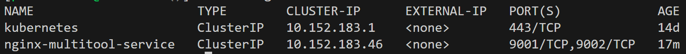
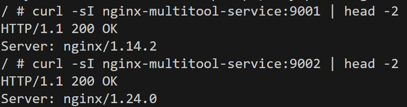
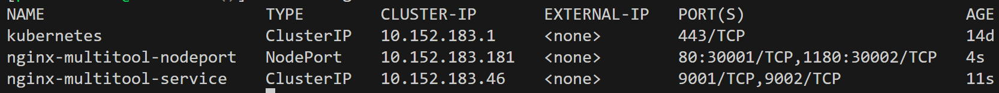
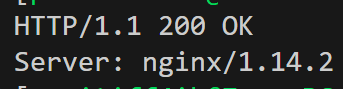
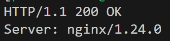
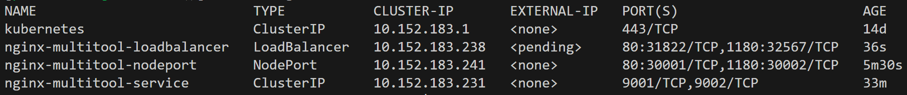
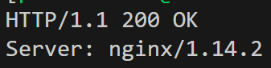
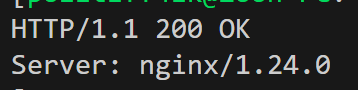

# Домашнее задание к занятию «Сетевое взаимодействие в K8S. Часть 1»

## [Задание](https://github.com/netology-code/kuber-homeworks/blob/1251f3685694d0e28a985cf4464ef8b94e9ccc09/1.4/1.4.md)

### Цель задания

В тестовой среде Kubernetes необходимо обеспечить доступ к приложению, установленному в предыдущем ДЗ и состоящему из двух контейнеров, по разным портам в разные контейнеры как внутри кластера, так и снаружи.


<details><summary>

### Описание

</summary>

------

### Задание 1. Создать Deployment и обеспечить доступ к контейнерам приложения по разным портам из другого Pod внутри кластера

1. Создать Deployment приложения, состоящего из двух контейнеров (nginx и multitool), с количеством реплик 3 шт.
2. Создать Service, который обеспечит доступ внутри кластера до контейнеров приложения из п.1 по порту 9001 — nginx 80, по 9002 — multitool 8080.
3. Создать отдельный Pod с приложением multitool и убедиться с помощью `curl`, что из пода есть доступ до приложения из п.1 по разным портам в разные контейнеры.
4. Продемонстрировать доступ с помощью `curl` по доменному имени сервиса.
5. Предоставить манифесты Deployment и Service в решении, а также скриншоты или вывод команды п.4.

------

### Задание 2. Создать Service и обеспечить доступ к приложениям снаружи кластера

1. Создать отдельный Service приложения из Задания 1 с возможностью доступа снаружи кластера к nginx, используя тип NodePort.
2. Продемонстрировать доступ с помощью браузера или `curl` с локального компьютера.
3. Предоставить манифест и Service в решении, а также скриншоты или вывод команды п.2.

------

### Правила приёма работы

1. Домашняя работа оформляется в своем Git-репозитории в файле README.md. Выполненное домашнее задание пришлите ссылкой на .md-файл в вашем репозитории.
2. Файл README.md должен содержать скриншоты вывода необходимых команд `kubectl` и скриншоты результатов.
3. Репозиторий должен содержать тексты манифестов или ссылки на них в файле README.md.

</details>

---

## Решение

### Задание 1

Сервис ClusterIP создался:
```commandline
$ kubectl get svc
```
> 

Приложения доступны по заданным портам изнутри кластера:
```commandline
$ kubectl run nwtool --image wbitt/network-multitool -it --rm -- sh
```
> 

Манифесты:
* [Deployment](kube_manifests/nginx-multitool/deployment.yaml)
* [Service (ClusterIP)](kube_manifests/nginx-multitool/service.yaml) 

---

### Задание 2

Сервис NodePort создался:
```commandline
$ kubectl get svc
```
> 

Приложения доступны по заданным портам с локальной машины:
```commandline
$ curl localhost:30001 -sI | head -2
```
> 

```commandline
$ curl localhost:30002 -sI | head -2
```
> 

Манифесты:
* [Deployment](kube_manifests/nginx-multitool/deployment.yaml)
* [NodePort](kube_manifests/nginx-multitool/nodeport.yaml)

---

### Задание *

Сервис LoadBalancer создался:
```commandline
$ kubectl get svc
```
> 

Приложения доступны по заданным портам с локальной машины:
```commandline
$ curl localhost:31822 -sI | head -2
```
> 

```commandline
$ curl localhost:32567 -sI | head -2
```
> 

Манифесты:
* [Deployment](kube_manifests/nginx/deployment.yaml)
* [LoadBalancer](kube_manifests/nginx/loadbalancer.yaml)