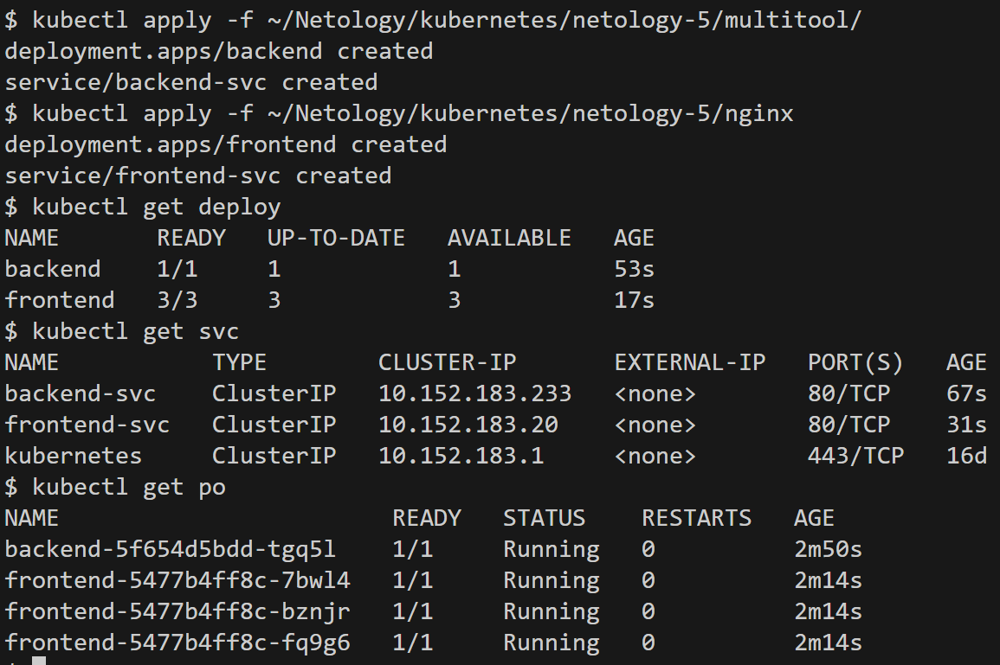
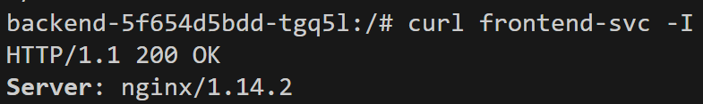
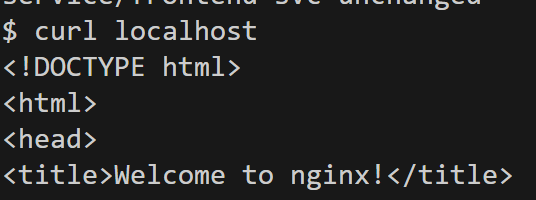
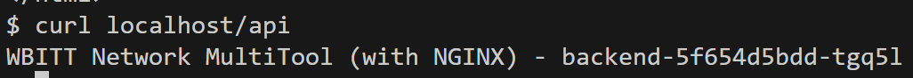

# Домашнее задание к занятию «Сетевое взаимодействие в K8S. Часть 2»

## [Задание](https://github.com/netology-code/kuber-homeworks/blob/1251f3685694d0e28a985cf4464ef8b94e9ccc09/1.5/1.5.md)

### Цель задания

В тестовой среде Kubernetes необходимо обеспечить доступ к двум приложениям снаружи кластера по разным путям.

<details><summary>

### Описание

</summary>

------

### Задание 1. Создать Deployment приложений backend и frontend

1. Создать Deployment приложения _frontend_ из образа nginx с количеством реплик 3 шт.
2. Создать Deployment приложения _backend_ из образа multitool. 
3. Добавить Service, которые обеспечат доступ к обоим приложениям внутри кластера. 
4. Продемонстрировать, что приложения видят друг друга с помощью Service.
5. Предоставить манифесты Deployment и Service в решении, а также скриншоты или вывод команды п.4.

------

### Задание 2. Создать Ingress и обеспечить доступ к приложениям снаружи кластера

1. Включить Ingress-controller в MicroK8S.
2. Создать Ingress, обеспечивающий доступ снаружи по IP-адресу кластера MicroK8S так, чтобы при запросе только по адресу открывался _frontend_ а при добавлении /api - _backend_.
3. Продемонстрировать доступ с помощью браузера или `curl` с локального компьютера.
4. Предоставить манифесты и скриншоты или вывод команды п.2.

------

### Правила приема работы

1. Домашняя работа оформляется в своем Git-репозитории в файле README.md. Выполненное домашнее задание пришлите ссылкой на .md-файл в вашем репозитории.
2. Файл README.md должен содержать скриншоты вывода необходимых команд `kubectl` и скриншоты результатов.
3. Репозиторий должен содержать тексты манифестов или ссылки на них в файле README.md.

</details>

---

## Решение

### Задание 1

Deployment и service создались:
> 

Из пода с Multitool можно "достучаться" до "frontend":
> 

Манифесты:
* [Backend](kube_manifests/multitool/)
* [Frontend](kube_manifests/nginx/)

---

### Задание 2

Включить ingress-контроллер в microk8s:
```commandline
$ microk8s enable ingress
```

Доступ до сервисов есть:
```commandline
$ curl localhost
```
> 

```commandline
curl localhost/api
```
> 

Манифесты:
* [Ingress](kube_manifests/ingress.yaml)
