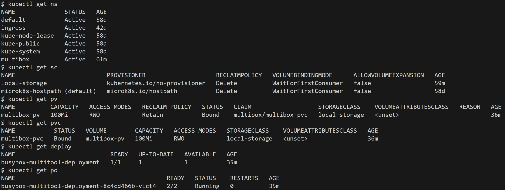
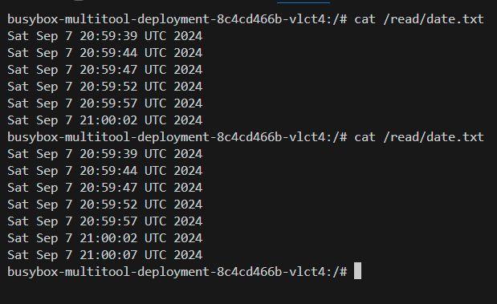
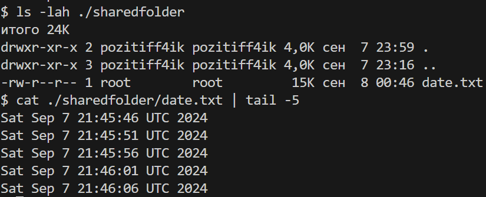
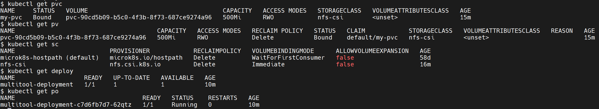
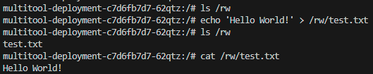
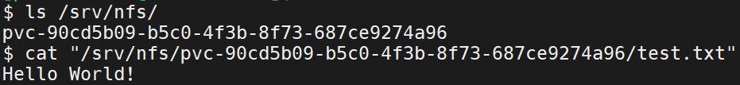
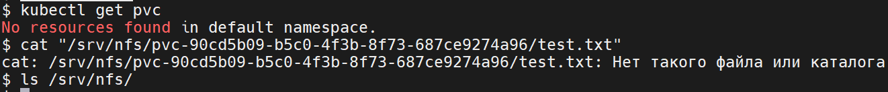

# Домашнее задание к занятию «Хранение в K8s. Часть 2»

## [Задание](https://github.com/netology-code/kuber-homeworks/blob/1251f3685694d0e28a985cf4464ef8b94e9ccc09/2.2/2.2.md)

### Цель задания

В тестовой среде Kubernetes нужно создать PV и продемонстрировать запись и хранение файлов.

<details><summary>

### Описание

</summary>

------

#### Задание 1

**Что нужно сделать**

Создать Deployment приложения, использующего локальный PV, созданный вручную.

1. Создать Deployment приложения, состоящего из контейнеров busybox и multitool.
2. Создать PV и PVC для подключения папки на локальной ноде, которая будет использована в поде.
3. Продемонстрировать, что multitool может читать файл, в который busybox пишет каждые пять секунд в общей директории. 
4. Удалить Deployment и PVC. Продемонстрировать, что после этого произошло с PV. Пояснить, почему.
5. Продемонстрировать, что файл сохранился на локальном диске ноды. Удалить PV.  Продемонстрировать что произошло с файлом после удаления PV. Пояснить, почему.
5. Предоставить манифесты, а также скриншоты или вывод необходимых команд.

------

#### Задание 2

**Что нужно сделать**

Создать Deployment приложения, которое может хранить файлы на NFS с динамическим созданием PV.

1. Включить и настроить NFS-сервер на MicroK8S.
2. Создать Deployment приложения состоящего из multitool, и подключить к нему PV, созданный автоматически на сервере NFS.
3. Продемонстрировать возможность чтения и записи файла изнутри пода. 
4. Предоставить манифесты, а также скриншоты или вывод необходимых команд.

------

#### Правила приёма работы

1. Домашняя работа оформляется в своём Git-репозитории в файле README.md. Выполненное задание пришлите ссылкой на .md-файл в вашем репозитории.
2. Файл README.md должен содержать скриншоты вывода необходимых команд `kubectl`, а также скриншоты результатов.
3. Репозиторий должен содержать тексты манифестов или ссылки на них в файле README.md.

</details>

---

## Решение

### Задание 1

Объекты создались:
> 
> Здесь создал также StorageClass `local-storage`, как описано в [документации](https://kubernetes.io/docs/concepts/storage/storage-classes/#local), для соблюдения всех указанных ограничений. В данном окружении на локальной машине его создание не обязательно.

Из контейнера с Multitool можно прочесть обновляемый каждый пять секунд через контейнер Busybox файл:
> 

После удаления Deployment и PVC PV перешёл в статус `Released`:
> ```commandline
> $ kubectl get pv
> NAME          CAPACITY   ACCESS MODES   RECLAIM POLICY   STATUS     CLAIM                   STORAGECLASS    VOLUMEATTRIBUTESCLASS   REASON   AGE
> multibox-pv   100Mi      RWO            Retain           Released   multibox/multibox-pvc   local-storage   <unset>                          6m2s
> ```
> Согласно [документации](https://kubernetes.io/docs/concepts/storage/persistent-volumes/#phase), статус `Released`: the claim has been deleted, but the associated storage resource is not yet reclaimed by the cluster

Файл `date.txt` остался на файловой системе хоста как после удаления Deployment и PVC, так и после удаления PV:
> ```commandline
> $ kubectl delete -f ./ -R
> namespace "multibox" deleted
> persistentvolume "multibox-pv" deleted
> storageclass.storage.k8s.io "local-storage" deleted
> Error from server (NotFound): error when deleting "deployment.yaml": deployments.apps "busybox-multitool-deployment" not found
> Error from server (NotFound): error when deleting "persistentvolumeclaim.yaml": persistentvolumeclaims "multibox-pvc" not found
> ```
> 
> Файл остался, так как в PV установлена политика `persistentVolumeReclaimPolicy: Retain` см. [документацию](https://kubernetes.io/docs/concepts/storage/persistent-volumes/#retain)

Манифесты:
* [Deployment](kube_manifests/deployment.yaml)
* [Namespace](kube_manifests/namespace.yaml)
* [PersistentVolume](kube_manifests/persistentvolume.yaml)
* [PersistentVolumeClaim](kube_manifests/persistentvolumeclaim.yaml)
* [StorageClass](kube_manifests/storageclass.yaml)

---

### Задание 2
Объекты pvc, pv, sc и deploy создались:
> 
> Для подготовки окружения использовалась [официальная инструкция](https://microk8s.io/docs/how-to-nfs) microk8s

Из контейнера с Multitool можно записывать и читать информацию с хоста:
> 

Проверка на хосте:
> 

Проверка, что будет после удаления pvc:
> 
> Файл, созданный в pod, удалился только после удаления pvc, но оставался после удаления pod. Причина - политика `reclaimPolicy: Delete` в манифесте создания StorageClass, означающая, что все созданные динамически pv будут удаляться, как и ресурсы, используемые ими на хостовой машине.

Манифесты:
* [Deployment](kube_manifests/nfs/deploy-nfs.yaml)
* [StorageClass](kube_manifests/nfs/sc-nfs.yaml)
* [PersistentVolumeClaim](kube_manifests/nfs/pvc-nfs.yaml)