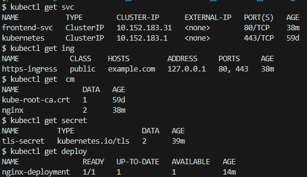

# Домашнее задание к занятию «Конфигурация приложений»

## [Задание](https://github.com/netology-code/kuber-homeworks/blob/1251f3685694d0e28a985cf4464ef8b94e9ccc09/2.3/2.3.md)

### Цель задания

В тестовой среде Kubernetes необходимо создать конфигурацию и продемонстрировать работу приложения.

### Описание

------

### Задание 1. Создать Deployment приложения и решить возникшую проблему с помощью ConfigMap. Добавить веб-страницу

1. Создать Deployment приложения, состоящего из контейнеров nginx и multitool.
2. Решить возникшую проблему с помощью ConfigMap.
3. Продемонстрировать, что pod стартовал и оба конейнера работают.
4. Сделать простую веб-страницу и подключить её к Nginx с помощью ConfigMap. Подключить Service и показать вывод curl или в браузере.
5. Предоставить манифесты, а также скриншоты или вывод необходимых команд.

------

### Задание 2. Создать приложение с вашей веб-страницей, доступной по HTTPS 

1. Создать Deployment приложения, состоящего из Nginx.
2. Создать собственную веб-страницу и подключить её как ConfigMap к приложению.
3. Выпустить самоподписной сертификат SSL. Создать Secret для использования сертификата.
4. Создать Ingress и необходимый Service, подключить к нему SSL в вид. Продемонстировать доступ к приложению по HTTPS. 
4. Предоставить манифесты, а также скриншоты или вывод необходимых команд.

------

### Правила приёма работы

1. Домашняя работа оформляется в своём GitHub-репозитории в файле README.md. Выполненное домашнее задание пришлите ссылкой на .md-файл в вашем репозитории.
2. Файл README.md должен содержать скриншоты вывода необходимых команд `kubectl`, а также скриншоты результатов.
3. Репозиторий должен содержать тексты манифестов или ссылки на них в файле README.md.

---

## Решение

### Задание 1

Объекты создались:
> 

После подключения Nodeport содержимое из ConfigMap доступно по порту контейнера Nginx:
> 

Проверка, что изменение содержимого ConfigMap отражается в контейнере с Nginx через некоторое время:
> 

Манифесты:
* [Deployment](kube_manifests/deployment.yaml)
* [ConfigMap](kube_manifests/configmap.yaml)
* [Service](kube_manifests/nodeport.yaml)

---

### Задание 2

Объекты создались:
> 

Доступ по https есть:
> 
> 
> При попытке достучаться по https возвращается код 308 так как по умолчанию Ingress Nginx переадресует запросы http на https. При добавлении аннотации `nginx.ingress.kubernetes.io/ssl-redirect: "False"` получаем искомую страницу:
>
> 

Манифесты:
* [Deployment](kube_manifests/tls/deployment.yaml)
* [ConfigMap](kube_manifests/tls/configmap.yaml)
* [Secret](kube_manifests/tls/secret.yaml)
* [Ingress](kube_manifests/tls/ingress.yaml)
* [Service](kube_manifests/tls/service.yaml)
