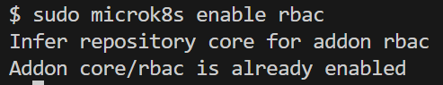
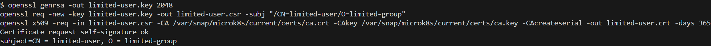
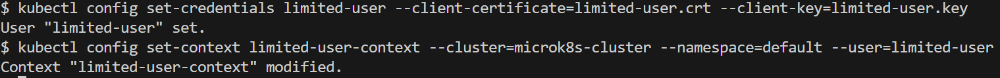
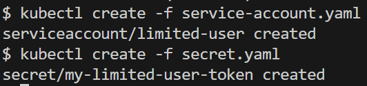
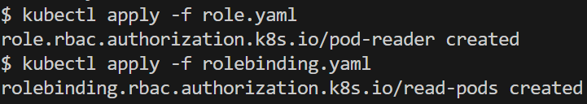
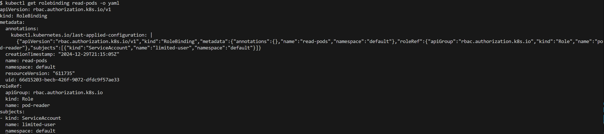
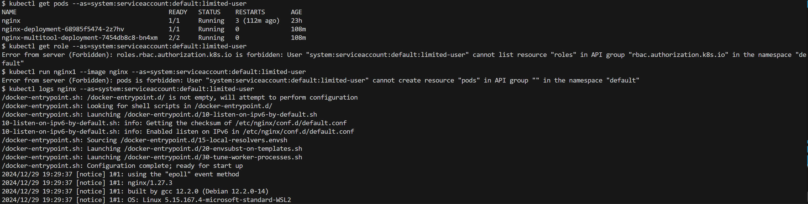

# Домашнее задание к занятию «Управление доступом»

## [Задание](https://github.com/netology-code/kuber-homeworks/blob/1251f3685694d0e28a985cf4464ef8b94e9ccc09/2.4/2.4.md)

### Цель задания

В тестовой среде Kubernetes нужно предоставить ограниченный доступ пользователю.

<details><summary>

### Описание

</summary>

------

### Задание 1. Создайте конфигурацию для подключения пользователя
1. Создайте и подпишите SSL-сертификат для подключения к кластеру.
2. Настройте конфигурационный файл kubectl для подключения.
3. Создайте роли и все необходимые настройки для пользователя.
4. Предусмотрите права пользователя. Пользователь может просматривать логи подов и их конфигурацию (kubectl logs pod <pod_id>, kubectl describe pod <pod_id>).
5. Предоставьте манифесты и скриншоты и/или вывод необходимых команд.

------

### Правила приёма работы
1. Домашняя работа оформляется в своём Git-репозитории в файле README.md. Выполненное домашнее задание пришлите ссылкой на .md-файл в вашем репозитории.
2. Файл README.md должен содержать скриншоты вывода необходимых команд kubectl, скриншоты результатов.
3. Репозиторий должен содержать тексты манифестов или ссылки на них в файле README.md.

</details>

---

## Решение

### Задание 1

1. Проверяем, что RBAC включен:

```shell
sudo microk8s enable rbac
```



2. Создание и подпись SSL-сертификата

```shell
openssl genrsa -out limited-user.key 2048
openssl req -new -key limited-user.key -out limited-user.csr -subj "/CN=limited-user/O=limited-group"
openssl x509 -req -in limited-user.csr -CA /var/snap/microk8s/current/certs/ca.crt -CAkey /var/snap/microk8s/current/certs/ca.key -CAcreateserial -out limited-user.crt -days 365
```



3. Настройка конфигурационного файла kubectl

```shell
kubectl config set-credentials limited-user --client-certificate=limited-user.crt --client-key=limited-user.key
kubectl config set-context limited-user-context --cluster=microk8s-cluster --namespace=default --user=limited-user
```



4. Создаём Service Account и привязываем Secret:

[service-account.yaml](./kube_manifests/service-account.yaml)
```yaml
apiVersion: v1
kind: ServiceAccount
metadata:
  name: limited-user
  namespace: default

```

[secret.yaml](./kube_manifests/secret.yaml)
```yaml
apiVersion: v1
kind: Secret
metadata:
  name: my-limited-user-token
  annotations:
    kubernetes.io/service-account.name: limited-user
type: kubernetes.io/service-account-token

```

```shell
kubectl create -f service-account.yaml
kubectl create -f secret.yaml
```



5. Создание роли с ограничением прав и привязка этой роли

[role.yaml](./kube_manifests/role.yaml)
```yaml
apiVersion: rbac.authorization.k8s.io/v1
kind: Role
metadata:
  namespace: default
  name: pod-reader
rules:
- apiGroups: [""]
  resources: ["pods/log", "pods"]
  verbs: ["get", "list"]

```

[rolebinding.yaml](./kube_manifests/rolebinding.yaml)
```yaml
apiVersion: rbac.authorization.k8s.io/v1
kind: RoleBinding
metadata:
  name: read-pods
  namespace: default
subjects:
- kind: ServiceAccount
  name: limited-user
  namespace: default
roleRef:
  kind: Role
  name: pod-reader
  apiGroup: rbac.authorization.k8s.io

```

```shell
kubectl apply -f role.yaml
kubectl apply -f rolebinding.yaml
```



Проверяем корректность привязки:
```shell
kubectl get rolebinding read-pods -o yaml
```



6. Проверка доступа
```shell
kubectl get pods --as=system:serviceaccount:default:limited-user
kubectl logs nginx --as=system:serviceaccount:default:limited-user
```
```shell
kubectl run nginx1 --image nginx --as=system:serviceaccount:default:limited-user
```



---