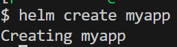
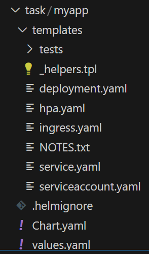
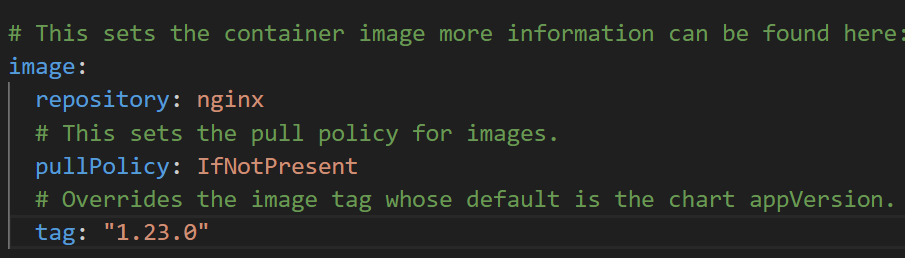
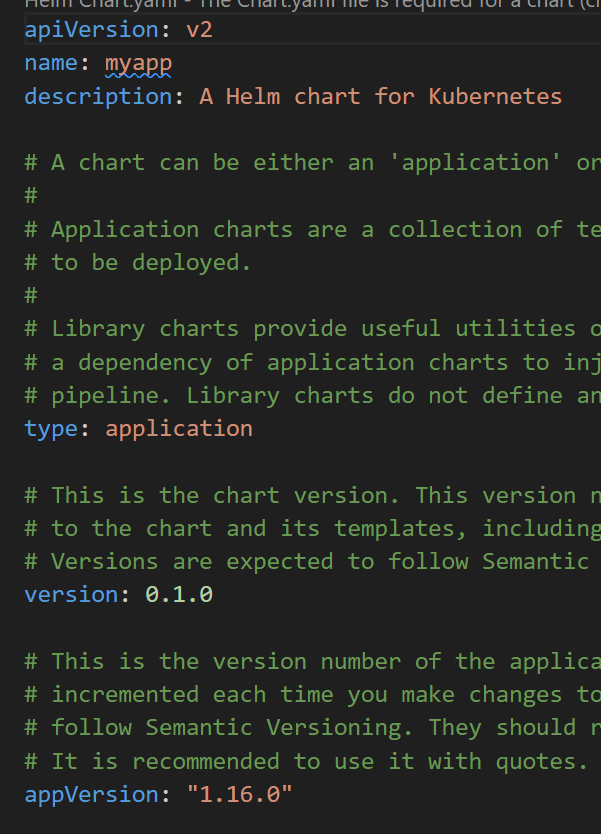
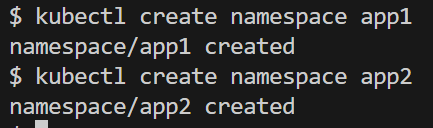
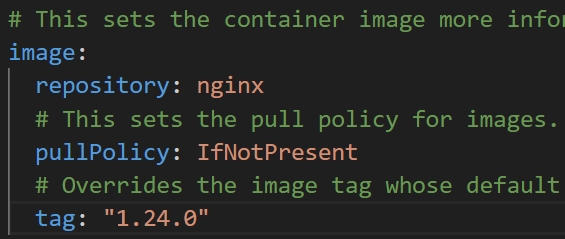
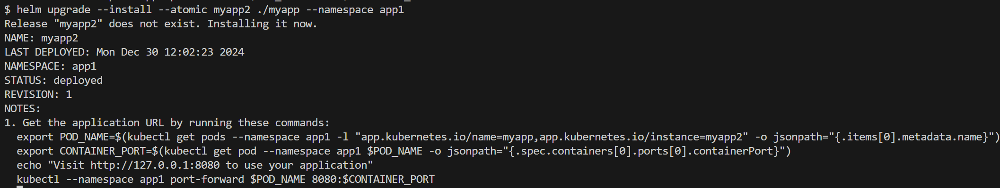
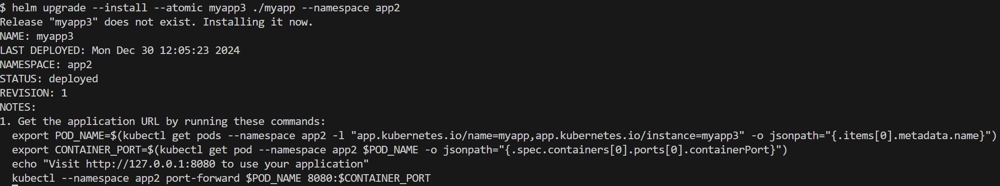
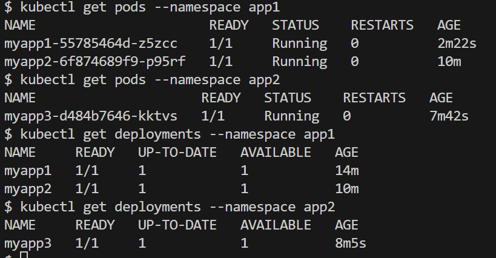

# Домашнее задание к занятию «Helm»

## [Задание](https://github.com/netology-code/kuber-homeworks/blob/1251f3685694d0e28a985cf4464ef8b94e9ccc09/2.5/2.5.md)

### Цель задания

В тестовой среде Kubernetes необходимо установить и обновить приложения с помощью Helm.

<details><summary>

### Описание

</summary>

------

### Задание 1. Подготовить Helm-чарт для приложения
1. Необходимо упаковать приложение в чарт для деплоя в разные окружения.
2. Каждый компонент приложения деплоится отдельным deployment’ом или statefulset’ом.
3. В переменных чарта измените образ приложения для изменения версии.

------

### Задание 2. Запустить две версии в разных неймспейсах

1. Подготовив чарт, необходимо его проверить. Запуститe несколько копий приложения.
2. Одну версию в namespace=app1, вторую версию в том же неймспейсе, третью версию в namespace=app2.
3. Продемонстрируйте результат.

---

### Правила приёма работы
1. Домашняя работа оформляется в своём Git репозитории в файле README.md. Выполненное домашнее задание пришлите ссылкой на .md-файл в вашем репозитории.
2. Файл README.md должен содержать скриншоты вывода необходимых команд kubectl, helm, а также скриншоты результатов.
3. Репозиторий должен содержать тексты манифестов или ссылки на них в файле README.md.

</details>

---

## Решение

### Задание 1

1. Создаём структуру Helm-чарта:

```shell
helm create myapp
```



2. Убеждаемся, что присутствует deployment и в нём только один компонент:

<details><summary>

templates/deployment.yaml

</summary>

```yaml
apiVersion: apps/v1
kind: Deployment
metadata:
  name: {{ include "myapp.fullname" . }}
  labels:
    {{- include "myapp.labels" . | nindent 4 }}
spec:
  {{- if not .Values.autoscaling.enabled }}
  replicas: {{ .Values.replicaCount }}
  {{- end }}
  selector:
    matchLabels:
      {{- include "myapp.selectorLabels" . | nindent 6 }}
  template:
    metadata:
      {{- with .Values.podAnnotations }}
      annotations:
        {{- toYaml . | nindent 8 }}
      {{- end }}
      labels:
        {{- include "myapp.labels" . | nindent 8 }}
        {{- with .Values.podLabels }}
        {{- toYaml . | nindent 8 }}
        {{- end }}
    spec:
      {{- with .Values.imagePullSecrets }}
      imagePullSecrets:
        {{- toYaml . | nindent 8 }}
      {{- end }}
      serviceAccountName: {{ include "myapp.serviceAccountName" . }}
      securityContext:
        {{- toYaml .Values.podSecurityContext | nindent 8 }}
      containers:
        - name: {{ .Chart.Name }}
          securityContext:
            {{- toYaml .Values.securityContext | nindent 12 }}
          image: "{{ .Values.image.repository }}:{{ .Values.image.tag | default .Chart.AppVersion }}"
          imagePullPolicy: {{ .Values.image.pullPolicy }}
          ports:
            - name: http
              containerPort: {{ .Values.service.port }}
              protocol: TCP
          livenessProbe:
            {{- toYaml .Values.livenessProbe | nindent 12 }}
          readinessProbe:
            {{- toYaml .Values.readinessProbe | nindent 12 }}
          resources:
            {{- toYaml .Values.resources | nindent 12 }}
          {{- with .Values.volumeMounts }}
          volumeMounts:
            {{- toYaml . | nindent 12 }}
          {{- end }}
      {{- with .Values.volumes }}
      volumes:
        {{- toYaml . | nindent 8 }}
      {{- end }}
      {{- with .Values.nodeSelector }}
      nodeSelector:
        {{- toYaml . | nindent 8 }}
      {{- end }}
      {{- with .Values.affinity }}
      affinity:
        {{- toYaml . | nindent 8 }}
      {{- end }}
      {{- with .Values.tolerations }}
      tolerations:
        {{- toYaml . | nindent 8 }}
      {{- end }}

```

</details>



3. Образ приложения изменяется в переменных чарта, находящихся в файле `values.yaml` - `image -> tag`



Или в `Chart.yaml` - `appVersion`



---

### Задание 2

1. Создаём namespace'ы

```shell
kubectl create namespace app1
kubectl create namespace app2
```



2. Устанавливаем приложение в первом namespace. Используем команду `helm upgrade` вместо `helm install`, так как она более универсальна - при необходимости обновить установленные приложения используется та же самая команда 

```shell
helm upgrade --install --atomic myapp1 ./myapp --namespace app1
```


3. Меняем `image.tag` в `values.yaml` на `1.24.0`:



4. Устанавливаем другую версию этого приложения в том же namespace:

```shell
helm upgrade --install --atomic myapp2 ./myapp --namespace app1
```



5. Устанавливаем третье приложение в другом namespace:

```shell
helm upgrade --install --atomic myapp3 ./myapp --namespace app2
```



---

Итоговый результат - все поды и деплойменты подняты:



[Helm chart](./helm_chart)