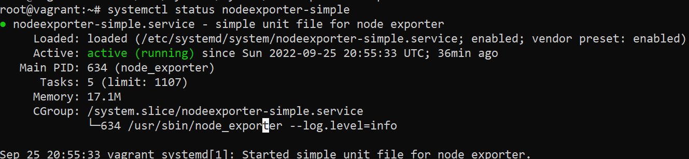
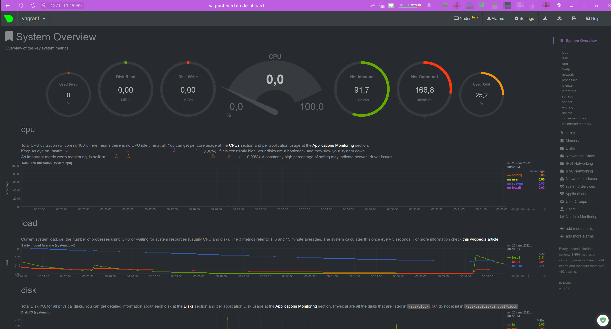

[Задание](https://github.com/netology-code/sysadm-homeworks/blob/devsys10/03-sysadmin-04-os/README.md)

---
##### 1. Используя знания из лекции по systemd, создайте самостоятельно простой unit-файл для node_exporter:

```commandline
[Unit]
Description=simple unit file for node exporter

[Service]
EnvironmentFile=/opt/node_exporter.env
ExecStart=/usr/sbin/node_exporter $EXTRA_OPTS
StandardOutput=file:/var/log/node_explorer.log
StandardError=file:/var/log/node_explorer.log

[Install]
WantedBy=multi-user.target
```

- поместите его в автозагрузку
  - `systemctl enable nodeexporter`
- предусмотрите возможность добавления опций к запускаемому процессу через внешний файл
  - `EnvironmentFile=/opt/node_exporter.env`
- удостоверьтесь, что с помощью systemctl процесс корректно стартует, завершается, а после перезагрузки автоматически поднимается
  - 

---
##### 2. Приведите несколько опций, которые вы бы выбрали для базового мониторинга хоста по CPU, памяти, диску и сети.

- CPU:
  - node_cpu_seconds_total{cpu="0",mode="idle"} 1043.06
  - node_cpu_seconds_total{cpu="0",mode="iowait"} 0.81
  - node_cpu_seconds_total{cpu="0",mode="system"} 6.96
  - node_cpu_seconds_total{cpu="0",mode="user"} 4.05
  - node_cpu_seconds_total{cpu="1",mode="idle"} 1034.01
  - node_cpu_seconds_total{cpu="1",mode="iowait"} 32.63
  - node_cpu_seconds_total{cpu="1",mode="system"} 22.78
  - node_cpu_seconds_total{cpu="1",mode="user"} 2.75

- MEM:
  - node_memory_MemAvailable_bytes 6.6449408e+08
  - node_memory_MemFree_bytes 4.146176e+08
  - node_memory_MemTotal_bytes 1.024090112e+09
  - node_memory_SwapCached_bytes 0
  - node_memory_SwapFree_bytes 2.047864832e+09
  - node_memory_SwapTotal_bytes 2.047864832e+09

- DISK:
  - node_filesystem_size_bytes{device="/dev/mapper/ubuntu--vg-ubuntu--lv",fstype="ext4",mountpoint="/"} 3.283910656e+10
  - node_filesystem_avail_bytes{device="/dev/mapper/ubuntu--vg-ubuntu--lv",fstype="ext4",mountpoint="/"} 2.6404888576e+10
  - node_filesystem_readonly{device="/dev/mapper/ubuntu--vg-ubuntu--lv",fstype="ext4",mountpoint="/"} 0

- NET:
  - node_network_info{address="00:00:00:00:00:00",broadcast="00:00:00:00:00:00",device="lo",duplex="",ifalias="",operstate="unknown"} 1
  - node_network_info{address="08:00:27:a2:6b:fd",broadcast="ff:ff:ff:ff:ff:ff",device="eth0",duplex="full",ifalias="",operstate="up"} 1
  - node_network_up{device="eth0"} 1
  - node_network_up{device="lo"} 0
  - node_network_mtu_bytes{device="eth0"} 1500
  - ode_network_mtu_bytes{device="lo"} 65536

---
##### 3. Netdata.



---
##### 4. Можно ли по выводу dmesg понять, осознает ли ОС, что загружена не на настоящем оборудовании, а на системе виртуализации?

Да:
```commandline
root@vagrant:~# dmesg | grep -i 'Hypervisor'
[    0.000000] Hypervisor detected: KVM
```
```commandline
vagrant@vagrant:~$ dmesg | grep -i "virt"
[    0.004789] CPU MTRRs all blank - virtualized system.
[    0.040514] Booting paravirtualized kernel on KVM
[   11.575986] systemd[1]: Detected virtualization oracle.
```

---
##### 5. Как настроен sysctl `fs.nr_open` на системе по-умолчанию?

```commandline
vagrant@vagrant:~$ sysctl fs.nr_open
fs.nr_open = 1048576
```

- Что означает этот параметр?
  - This denotes the maximum number of file-handles a process can allocate. Default value is 1024*1024 (1048576) which should be enough for most machines. Actual limit depends on RLIMIT_NOFILE resource limit.
    - Максимальное количество дескрипторов файлов, которые может выделить процесс (1024*1024)
- Какой другой существующий лимит не позволит достичь такого числа (ulimit --help)?
  - `ulimit -n` - the maximum number of open file descriptors (1024). Values are in 1024-byte increments

---
##### 6. Запустите любой долгоживущий процесс. Покажите, что ваш процесс работает под PID 1 через `nsenter`

```commandline
root@vagrant:~# nsenter --target 1918 --pid --mount
root@vagrant:/# ps aux
USER         PID %CPU %MEM    VSZ   RSS TTY      STAT START   TIME COMMAND
root           1  0.0  0.0   5476   580 pts/2    S+   21:48   0:00 sleep 1h
root           2  0.0  0.4   7236  4096 pts/3    S    22:05   0:00 -bash
root          13  0.0  0.3   8888  3296 pts/3    R+   22:05   0:00 ps aux
```

---
##### 7. Что такое `:(){ :|:& };:`?

[fork-бомба](https://ru.wikipedia.org/wiki/Fork-бомба), которая исчерпывает pid'ы. Функция с именем `:`, которая порождает саму себя дважды (через пайп) в фоне и сама себя вызывает. При отсутствии лимита на число процессов машина быстро исчерпывает физическую память.
Чуть более понятный вариант написания:
```commandline
f()
{
    f|f&
};
f
```

- Какой механизм помог автоматической стабилизации?
  - лимит в cgroup
    - ```commandline
      [ 4602.298090] cgroup: fork rejected by pids controller in /user.slice/user-1000.slice/session-12.scope
      ```
- Как настроен этот механизм по-умолчанию, и как изменить число процессов, которое можно создать в сессии?
  - Посмотреть:
    - ```commandline
        vagrant@vagrant:~$ cat /sys/fs/cgroup/pids/user.slice/user-1000.slice/pids.max
        2345
        ```
    - также параметр *TasksMax* в `/usr/lib/systemd/system/user-.slice.d/10-defaults.conf`
      - ```commandline
        [Slice]
        TasksMax=33%
        ```
  - Соответственно, изменить число процессов можно, указав в TasksMax нужное к-во в относительном или абсолютном виде. `infinity` уберёт лимит 