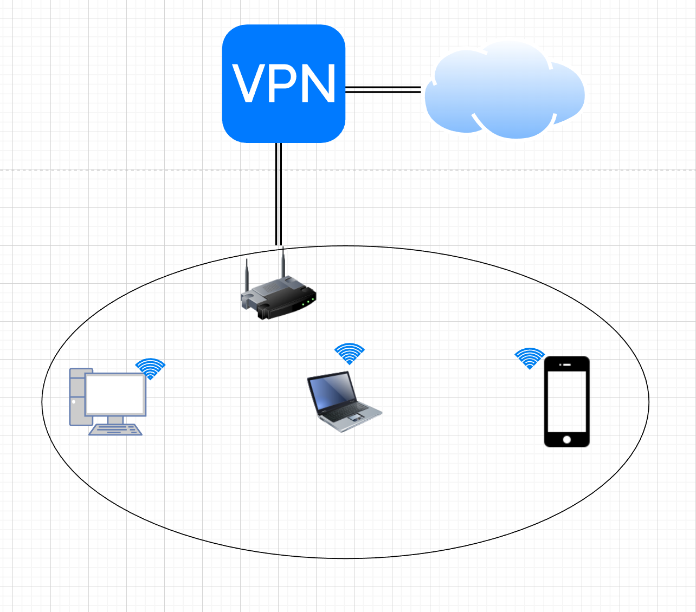

[Задание](https://github.com/netology-code/sysadm-homeworks/blob/devsys10/03-sysadmin-08-net/README.md)

---
##### 1. Подключитесь к публичному маршрутизатору в интернет. Найдите маршрут к вашему публичному IP
```shell
route-views>show ip route 5.181.xxx.xxx
Routing entry for 5.181.xxx.0/24
  Known via "bgp 6447", distance 20, metric 10
  Tag 3257, type external
  Last update from 89.149.178.10 5w2d ago
  Routing Descriptor Blocks:
  * 89.149.178.10, from 89.149.178.10, 5w2d ago
      Route metric is 10, traffic share count is 1
      AS Hops 3
      Route tag 3257
      MPLS label: none
```
```shell
route-views>show bgp  5.181.xxx.xxx
BGP routing table entry for 5.181.xxx.0/24, version 2605488313
Paths: (20 available, best #20, table default)
  Not advertised to any peer
  Refresh Epoch 1
  6939 199524 202422
    64.71.137.241 from 64.71.137.241 (216.218.252.164)
      Origin IGP, localpref 100, valid, external
      path 7FE10B3AECD0 RPKI State not found
      rx pathid: 0, tx pathid: 0
  Refresh Epoch 1
  20912 3257 199524 202422
    212.66.96.126 from 212.66.96.126 (212.66.96.126)
      Origin IGP, localpref 100, valid, external
      Community: 3257:4000 3257:8100 3257:50001 3257:50110 3257:53100 3257:53101 20912:65004
      path 7FE0D6EF48D8 RPKI State not found
      rx pathid: 0, tx pathid: 0
  Refresh Epoch 1
  3549 3356 1299 199524 202422
    208.51.134.254 from 208.51.134.254 (67.16.168.191)
      Origin IGP, metric 0, localpref 100, valid, external
      Community: 3356:3 3356:22 3356:86 3356:575 3356:666 3356:903 3356:2011 3549:2581 3549:3
      path 7FE0F384C268 RPKI State not found
      rx pathid: 0, tx pathid: 0
  Refresh Epoch 1
  53767 174 199524 202422
    162.251.163.2 from 162.251.163.2 (162.251.162.3)
      Origin IGP, localpref 100, valid, external
      Community: 174:21101 174:22010 53767:5000
      path 7FE0DB38DB90 RPKI State not found
      rx pathid: 0, tx pathid: 0
  Refresh Epoch 1
  3561 209 3356 1299 199524 202422
    206.24.210.80 from 206.24.210.80 (206.24.210.80)
      Origin IGP, localpref 100, valid, external
      path 7FE0CF367D40 RPKI State not found
      rx pathid: 0, tx pathid: 0
  Refresh Epoch 1
  3267 199524 202422
    194.85.40.15 from 194.85.40.15 (185.141.126.1)
      Origin IGP, metric 0, localpref 100, valid, external
      path 7FE0F32884F0 RPKI State not found
      rx pathid: 0, tx pathid: 0
  Refresh Epoch 1
  8283 199524 202422
    94.142.247.3 from 94.142.247.3 (94.142.247.3)
      Origin IGP, metric 0, localpref 100, valid, external
      Community: 8283:1 8283:101
      unknown transitive attribute: flag 0xE0 type 0x20 length 0x24
        value 0000 205B 0000 0000 0000 0001 0000 205B
              0000 0005 0000 0001 0000 205B 0000 0008
              0000 001A
      path 7FE16B72E888 RPKI State not found
      rx pathid: 0, tx pathid: 0
  Refresh Epoch 1
  4901 6079 6830 199524 202422
    162.250.137.254 from 162.250.137.254 (162.250.137.254)
      Origin IGP, localpref 100, valid, external
      Community: 65000:10100 65000:10300 65000:10400
      path 7FE041AB4990 RPKI State not found
      rx pathid: 0, tx pathid: 0
  Refresh Epoch 1
  3333 199524 202422
```

---
##### 2. Создайте dummy0 интерфейс в Ubuntu. Добавьте несколько статических маршрутов. Проверьте таблицу маршрутизации.
2. 1. Создаём непостоянный dummy-интерфейс
```shell
~# ip link add name dummy0 type dummy
````
2. 2. Настройка интерфейса (делаем интерфейс постоянным и добавляем ip
```shell
~# cat << "EOF" >> /etc/systemd/network/dummy0.netdev
[NetDev]
Name=dummy0
Kind=dummy
EOF
```
```shell
~# cat << "EOF" >> /etc/systemd/network/dummy0.network
[Match]
Name=dummy0

[Network]
Address=10.0.8.1/24
EOF
````

2. 3. Ребутаем networkd для применения изменений
```shell
~# systemctl restart systemd-networkd
```
2. 4. Добавляем статический ip:
- Создаём файл конфигурации 02-networkd.yaml сразу в текстовом редакторе
    ```shell
    ~# vi /etc/netplan/02-networkd.yaml
    ```
- Прописываем нашу конфигурацию
  ```shell
  network:
    version: 2
    renderer: networkd
    ethernets:
      eth0:
        addresses:
          - 10.0.2.4/24
        gateway4: 10.0.2.2
        routes:
          - to: 10.0.4.0/24
            via: 10.0.2.3
  ```
- Применяем
  ```shell
  ~# netplan apply
  ```
- Проверяем
  ```shell
  ~# ip r | grep static
  default via 10.0.2.2 dev eth0 proto static
  10.0.4.0/24 via 10.0.2.3 dev eth0 proto static
  ```

---
##### 3. Проверьте открытые TCP порты в Ubuntu, какие протоколы и приложения используют эти порты? Приведите несколько примеров.

```shell
~# ss -tnlp
State         Recv-Q        Send-Q                 Local Address:Port                 Peer Address:Port        Process
LISTEN        0             4096                   127.0.0.53%lo:53                        0.0.0.0:*            users:(("systemd-resolve",pid=627,fd=13))
LISTEN        0             128                          0.0.0.0:22                        0.0.0.0:*            users:(("sshd",pid=691,fd=3))
LISTEN        0             128                             [::]:22                           [::]:*            users:(("sshd",pid=691,fd=4))
```
:53 - DNS
:22 - SSH

---
##### 4. Проверьте используемые UDP сокеты в Ubuntu, какие протоколы и приложения используют эти порты?

```shell
~# ss -unap
State         Recv-Q        Send-Q                 Local Address:Port                 Peer Address:Port        Process
UNCONN        0             0                      127.0.0.53%lo:53                        0.0.0.0:*            users:(("systemd-resolve",pid=627,fd=12))
UNCONN        0             0                     10.0.2.15%eth0:68                        0.0.0.0:*            users:(("systemd-network",pid=622,fd=19))
```
:53 - DNS
:68 - Используется на стороне клиента для получения информации о динамической IP-адресации от DHCP-сервера.

---
##### 5. Используя diagrams.net, создайте L3 диаграмму вашей домашней сети или любой другой сети, с которой вы работали.

