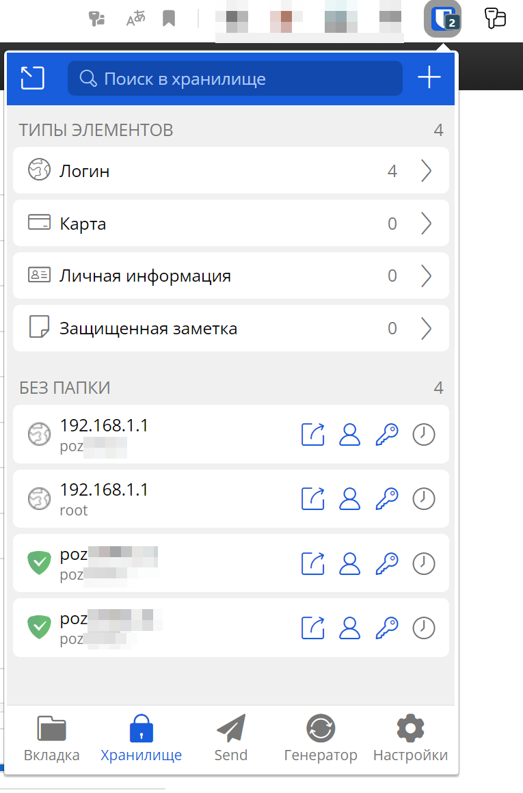
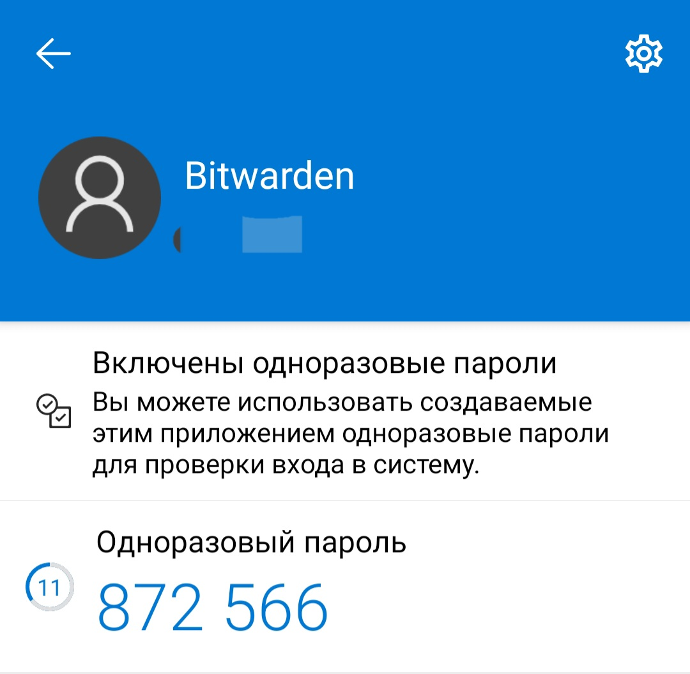
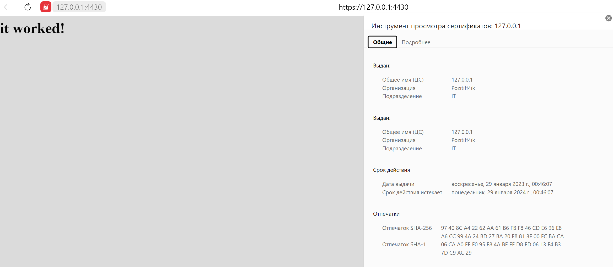
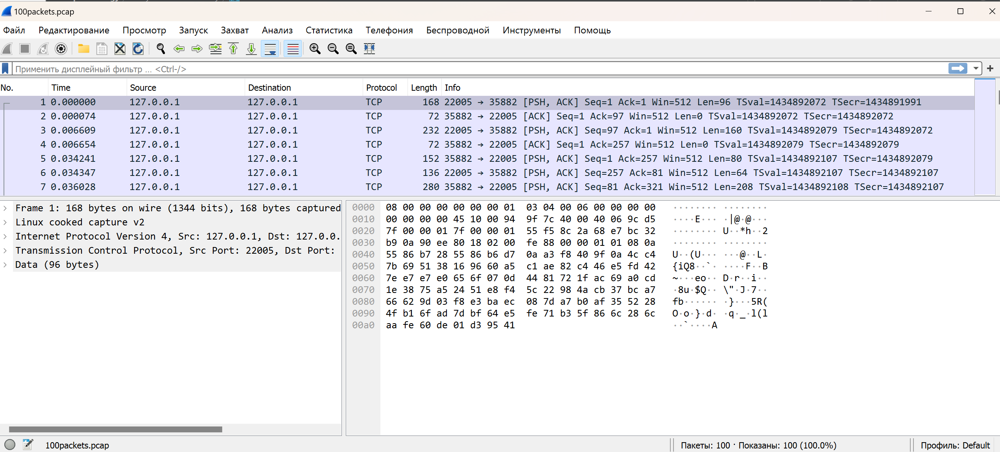

[Задание](https://github.com/netology-code/sysadm-homeworks/blob/devsys10/03-sysadmin-09-security/README.md)

---
##### 1. Установите Bitwarden плагин для браузера. Зарегестрируйтесь и сохраните несколько паролей.



---

##### 2. Установите Google authenticator на мобильный телефон. Настройте вход в Bitwarden акаунт через Google authenticator OTP.

Использовал Microsoft Authenticator



---
##### 3. Установите apache2, сгенерируйте самоподписанный сертификат, настройте тестовый сайт для работы по HTTPS.

Использовал ВМ с пробросом портов в Vagrantfile



---
##### 4. Проверьте на TLS уязвимости произвольный сайт в интернете

```shell
$ ./testssl.sh -U --sneaky netology.ru

Further IP addresses:   188.114.99.234
 rDNS (188.114.98.234):  --
 Service detected:       HTTP


 Testing vulnerabilities

 Heartbleed (CVE-2014-0160)                not vulnerable (OK), no heartbeat extension
 CCS (CVE-2014-0224)                       not vulnerable (OK)
 Ticketbleed (CVE-2016-9244), experiment.  not vulnerable (OK)
 ROBOT                                     not vulnerable (OK)
 Secure Renegotiation (RFC 5746)           supported (OK)
 Secure Client-Initiated Renegotiation     not vulnerable (OK)
 CRIME, TLS (CVE-2012-4929)                not vulnerable (OK)
 BREACH (CVE-2013-3587)                    potentially NOT ok, "gzip" HTTP compression detected. - only supplied "/" tested
                                           Can be ignored for static pages or if no secrets in the page
 POODLE, SSL (CVE-2014-3566)               not vulnerable (OK)
 TLS_FALLBACK_SCSV (RFC 7507)              Downgrade attack prevention supported (OK)
 SWEET32 (CVE-2016-2183, CVE-2016-6329)    VULNERABLE, uses 64 bit block ciphers
 FREAK (CVE-2015-0204)                     not vulnerable (OK)
 DROWN (CVE-2016-0800, CVE-2016-0703)      not vulnerable on this host and port (OK)
                                           make sure you don't use this certificate elsewhere with SSLv2 enabled services, see
                                           https://search.censys.io/search?resource=hosts&virtual_hosts=INCLUDE&q=A3C7D9A8D3805171D99EA61F5C80B8ADF49B93BA21EBB492D78512BA254E90A5
 LOGJAM (CVE-2015-4000), experimental      not vulnerable (OK): no DH EXPORT ciphers, no DH key detected with <= TLS 1.2
 BEAST (CVE-2011-3389)                     TLS1: ECDHE-RSA-AES128-SHA AES128-SHA ECDHE-RSA-AES256-SHA AES256-SHA DES-CBC3-SHA
                                           VULNERABLE -- but also supports higher protocols  TLSv1.1 TLSv1.2 (likely mitigated)
 LUCKY13 (CVE-2013-0169), experimental     potentially VULNERABLE, uses cipher block chaining (CBC) ciphers with TLS. Check patches
 Winshock (CVE-2014-6321), experimental    not vulnerable (OK)
 RC4 (CVE-2013-2566, CVE-2015-2808)        no RC4 ciphers detected (OK)
```

---
##### 5. Установите на Ubuntu ssh сервер, сгенерируйте новый приватный ключ. Скопируйте свой публичный ключ на другой сервер. Подключитесь к серверу по SSH-ключу.

```shell
vagrant@server1:~$ ssh-keygen
Generating public/private rsa key pair.
Enter file in which to save the key (/home/vagrant/.ssh/id_rsa): myssh
....
vagrant@server1:~$ ssh-copy-id -i .ssh/myssh vagrant@192.168.56.12
....
vagrant@server1:~$ ssh -i .ssh/myssh vagrant@192.168.56.12
Welcome to Ubuntu 20.04.5 LTS (GNU/Linux 5.4.0-135-generic x86_64)
....
vagrant@server2:~$
```

---
##### 6. Переименуйте файлы ключей из задания 5. Настройте файл конфигурации SSH клиента, так чтобы вход на удаленный сервер осуществлялся по имени сервера.

```shell
$ mv ~/.ssh/myssh ~/.ssh/myssh_task6
$ touch ~/.ssh/config && chmod 600 ~/.ssh/config
$ vi ~/.ssh/config
Host server2
  HostName 192.168.56.12
  User vagrant
  Port 22
  IdentityFile ~/.ssh/myssh_task6
$ ssh server2
Welcome to Ubuntu 20.04.5 LTS (GNU/Linux 5.4.0-135-generic x86_64)
....
vagrant@server2:~$
```

---
##### 7. Соберите дамп трафика утилитой tcpdump в формате pcap, 100 пакетов. Откройте файл pcap в Wireshark.

```shell
$ sudo tcpdump -nnei any -c 100 -w 100packets.pcap
[sudo] пароль для pozitiff4ik:
tcpdump: data link type LINUX_SLL2
tcpdump: listening on any, link-type LINUX_SLL2 (Linux cooked v2), snapshot length 262144 bytes
100 packets captured
234 packets received by filter
0 packets dropped by kernel
```



---
##### 8. Просканируйте хост scanme.nmap.org. Какие сервисы запущены?

```shell
# nmap -T4 -A -v scanme.nmap.org
Starting Nmap 7.92 ( https://nmap.org ) at 2023-01-29 03:06 Russia TZ 2
Nmap scan report for scanme.nmap.org (45.33.32.156)
Host is up (0.19s latency).
Not shown: 995 closed tcp ports (reset)
PORT      STATE SERVICE    VERSION
22/tcp    open  ssh        OpenSSH 6.6.1p1 Ubuntu 2ubuntu2.13 (Ubuntu Linux; protocol 2.0)
| ssh-hostkey: 
|   1024 ac:00:a0:1a:82:ff:cc:55:99:dc:67:2b:34:97:6b:75 (DSA)
|   2048 20:3d:2d:44:62:2a:b0:5a:9d:b5:b3:05:14:c2:a6:b2 (RSA)
|   256 96:02:bb:5e:57:54:1c:4e:45:2f:56:4c:4a:24:b2:57 (ECDSA)
|_  256 33:fa:91:0f:e0:e1:7b:1f:6d:05:a2:b0:f1:54:41:56 (ED25519)
53/tcp    open  domain     Unbound
80/tcp    open  http       Apache httpd 2.4.7
|_http-favicon: Nmap Project
| http-methods: 
|_  Supported Methods: GET HEAD POST OPTIONS
|_http-title: Go ahead and ScanMe!
|_http-server-header: Apache/2.4.7 (Ubuntu)
9929/tcp  open  nping-echo Nping echo
31337/tcp open  tcpwrapped

Nmap done: 1 IP address (1 host up) scanned in 49.97 seconds
           Raw packets sent: 1084 (49.572KB) | Rcvd: 1094 (47.718KB)
```
Подняты сервисы ssh, web-server, DNS-server, nping-echo server, открыт порт 31337

---

##### 9. Установите и настройте фаервол ufw на web-сервер из задания 3. Откройте доступ снаружи только к портам 22,80,443

```shell
$ sudo ufw enable
$ sudo ufw default deny incoming
$ sudo ufw default allow outgoing
$ sudo ufw allow 22/tcp
$ sudo ufw allow 80/tcp
$ sudo ufw allow 443/tcp
$ sudo ufw status verbose
Status: active
Logging: on (low)
Default: deny (incoming), allow (outgoing), deny (routed)
New profiles: skip

To                         Action      From
--                         ------      ----
22/tcp                     ALLOW IN    Anywhere
80/tcp                     ALLOW IN    Anywhere
443/tcp                    ALLOW IN    Anywhere
22/tcp (v6)                ALLOW IN    Anywhere (v6)
80/tcp (v6)                ALLOW IN    Anywhere (v6)
443/tcp (v6)               ALLOW IN    Anywhere (v6)