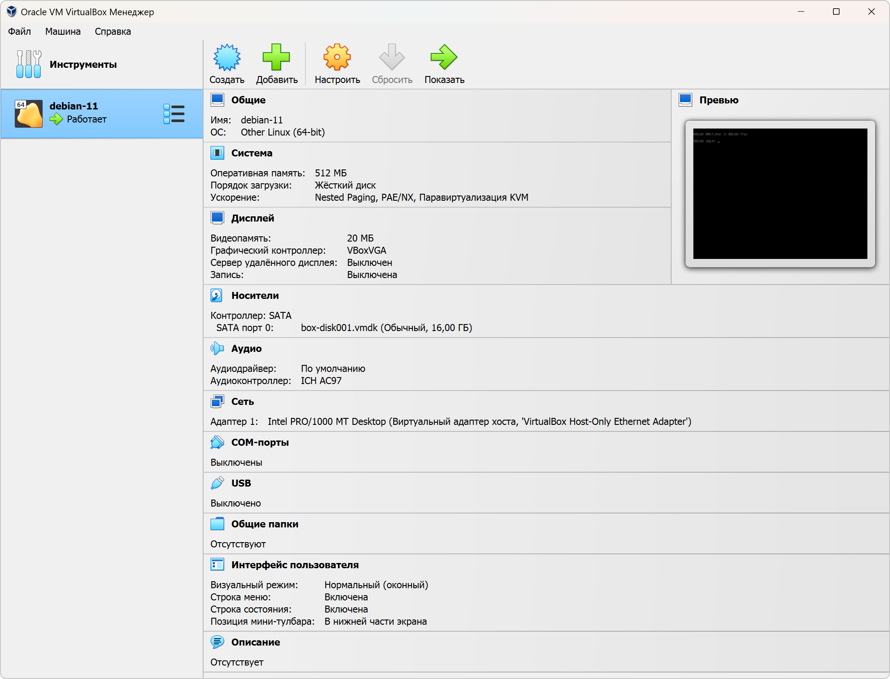

[Задание](https://github.com/netology-code/ter-homeworks/blob/main/01/hw-01.md)

------

### Задание 1

1. Перейдите в каталог [**src**](https://github.com/netology-code/ter-homeworks/tree/main/01/src). Скачайте все необходимые зависимости, использованные в проекте.

**Ответ:** Вывод команды

<details><summary>$ terraform init</summary>

```terraform
~/Netology/Terrafofm-lesson/ter-homeworks/01/src(main)]$ terraform init

Initializing the backend...

Initializing provider plugins...
- Finding kreuzwerker/docker versions matching "~> 3.0.1"...
- Finding latest version of hashicorp/random...
- Installing kreuzwerker/docker v3.0.2...
- Installed kreuzwerker/docker v3.0.2 (unauthenticated)
- Installing hashicorp/random v3.5.1...
- Installed hashicorp/random v3.5.1 (unauthenticated)

Terraform has created a lock file .terraform.lock.hcl to record the provider
selections it made above. Include this file in your version control repository
so that Terraform can guarantee to make the same selections by default when
you run "terraform init" in the future.

╷
│ Warning: Incomplete lock file information for providers
│
│ Due to your customized provider installation methods, Terraform was forced to calculate lock file checksums locally for the following providers:
│   - hashicorp/random
│   - kreuzwerker/docker
│
│ The current .terraform.lock.hcl file only includes checksums for linux_amd64, so Terraform running on another platform will fail to install these providers.
│
│ To calculate additional checksums for another platform, run:
│   terraform providers lock -platform=linux_amd64
│ (where linux_amd64 is the platform to generate)
╵

Terraform has been successfully initialized!

You may now begin working with Terraform. Try running "terraform plan" to see
any changes that are required for your infrastructure. All Terraform commands
should now work.

If you ever set or change modules or backend configuration for Terraform,
rerun this command to reinitialize your working directory. If you forget, other
commands will detect it and remind you to do so if necessary.
```

</details>

2. Изучите файл **.gitignore**. В каком terraform-файле, согласно этому .gitignore, допустимо сохранить личную, секретную информацию?

<details><summary>Содержимое файла .gitignore</summary>

```gitignore
# Local .terraform directories and files
**/.terraform/*
.terraform*

# .tfstate files
*.tfstate
*.tfstate.*

# own secret vars store.
personal.auto.tfvars
```

</details>

**Ответ:** `personal.auto.tfvars` 

3. Выполните код проекта. Найдите  в state-файле секретное содержимое созданного ресурса **random_password**, пришлите в качестве ответа конкретный ключ и его значение.

**Ответ:** `"result": "G4JgduosyikCIcCA"`


4. Раскомментируйте блок кода, примерно расположенный на строчках 29–42 файла **main.tf**.
Выполните команду ```terraform validate```. Объясните, в чём заключаются намеренно допущенные ошибки. Исправьте их.

**Ответ:**

<details><summary>Некорректный код:</summary>

```terraform
terraform {
  required_providers {
    docker = {
      source  = "kreuzwerker/docker"
      version = "~> 3.0.1"
    }
  }
  required_version = ">=0.13" /*Многострочный комментарий.
 Требуемая версия terraform */
}
provider "docker" {}

#однострочный комментарий

resource "random_password" "random_string" {
  length      = 16
  special     = false
  min_upper   = 1
  min_lower   = 1
  min_numeric = 1
}

resource "docker_image" {
  name         = "nginx:latest"
  keep_locally = true
}

resource "docker_container" "1nginx" {
  image = docker_image.nginx.image_id
  name  = "example_${random_password.random_string_FAKE.resulT}"

  ports {
    internal = 80
    external = 8000
  }
}
```

</details>

<details><summary>Результат команды terraform validate:</summary>

```terraform
│ Error: Missing name for resource
│
│   on main.tf line 23, in resource "docker_image":
│   23: resource "docker_image" {
│
│ All resource blocks must have 2 labels (type, name).
╵
╷
│ Error: Invalid resource name
│
│   on main.tf line 28, in resource "docker_container" "1nginx":
│   28: resource "docker_container" "1nginx" {
│
│ A name must start with a letter or underscore and may contain only letters, digits, underscores, and dashes.
╵
╷
│ Error: Reference to undeclared resource
│
│   on main.tf line 30, in resource "docker_container" "nginx":
│   30:   name  = "example_${random_password.random_string_FAKE.resulT}"
│
│ A managed resource "random_password" "random_string_FAKE" has not been declared in the root module.
╵
╷
│ Error: Unsupported attribute
│
│   on main.tf line 30, in resource "docker_container" "nginx":
│   30:   name  = "example_${random_password.random_string.resulT}"
│
│ This object has no argument, nested block, or exported attribute named "resulT". Did you mean "result"?
╵

```

</details>

- **Ошибка 1:** Строка 23. Пропущен label name (имя) ресурса `docker_image`. Назовём `nginx`.
- **Ошибка 2:** Строка 28. Нельзя начинать имя ресурса с цифр - только с букв или нижнего подчёркивания. Уберём цифру 1.
- **Ошибка 3:** Строка 30. Имя ресурса `random_string_FAKE`, к которому обращаемся, не было задекларировано ранее. Уберём `_FAKE` из имени.
- **Ошибка 4:** Строка 30. Нет такого аргумента `resulT`. Видимо, HCL чувствителен к регистру. Изменим T на t, как предлагает Terraform.

5. Выполните код. В качестве ответа приложите: исправленный фрагмент кода и вывод команды ```docker ps```.

**Ответ:**

Исправленный фрагмент кода:

```terraform
resource "docker_image" "nginx" {
  name         = "nginx:latest"
  keep_locally = true
}

resource "docker_container" "nginx" {
  image = docker_image.nginx.image_id
  name  = "example_${random_password.random_string.result}"

  ports {
    internal = 80
    external = 8000
  }
```

Вывод команды ```docker ps```
```shell
CONTAINER ID   IMAGE          COMMAND                  CREATED          STATUS          PORTS                  NAMES
a896d23fb36d   61395b4c586d   "/docker-entrypoint.…"   42 seconds ago   Up 40 seconds   0.0.0.0:8000->80/tcp   example_G4JgduosyikCIcCA
```

6. Замените имя docker-контейнера в блоке кода на ```hello_world```. Не перепутайте имя контейнера и имя образа. Мы всё ещё продолжаем использовать name = "nginx:latest". Выполните команду ```terraform apply -auto-approve```.
Объясните своими словами, в чём может быть опасность применения ключа  ```-auto-approve```. В качестве ответа дополнительно приложите вывод команды ```docker ps```.

**Ответ:**

```-auto-approve``` имеет смысл применять только когда чётко знаешь, что будет изменено и твёрдо уверен, что это необходимо изменить. В таком случае это поможет сэкономить время на проверке вносимых изменений. В противном же случае есть риск внести непоправимые изменения в управляемую инфраструктуру, т.к. изменения, вносимые командой `terraform apply -auto-approve ` не обратимы.   

Вывод команды ```docker ps```
```shell
CONTAINER ID   IMAGE          COMMAND                  CREATED         STATUS         PORTS                  NAMES
df2c404636b6   61395b4c586d   "/docker-entrypoint.…"   9 seconds ago   Up 9 seconds   0.0.0.0:8000->80/tcp   hello_world

```

8. Уничтожьте созданные ресурсы с помощью **terraform**. Убедитесь, что все ресурсы удалены. Приложите содержимое файла **terraform.tfstate**.

**Ответ:**

```terraform
{
  "version": 4,
  "terraform_version": "1.5.7",
  "serial": 11,
  "lineage": "8cd48715-3652-89b5-efec-f6d01d274323",
  "outputs": {},
  "resources": [],
  "check_results": null
}
```

9. Объясните, почему при этом не был удалён docker-образ **nginx:latest**. Ответ **обязательно** подкрепите строчкой из документации [**terraform провайдера docker**](https://docs.comcloud.xyz/providers/kreuzwerker/docker/latest/docs).  (ищите в классификаторе resource docker_image )

**Ответ:**

Использовался параметр `keep_locally = true`, при котором образ не удалятся после `terraform destroy`. Судя по всему, по умолчанию стоит `false`.

> keep_locally (Boolean) If true, then the Docker image won't be deleted on destroy operation. If this is false, it will delete the image from the docker local storage on destroy operation.


------

## Дополнительное задание (со звёздочкой*)

### Задание 2*

1. Изучите в документации provider [**Virtualbox**](https://docs.comcloud.xyz/providers/shekeriev/virtualbox/latest/docs) от 
shekeriev.
2. Создайте с его помощью любую виртуальную машину. Чтобы не использовать VPN, советуем выбрать любой образ с расположением в GitHub из [**списка**](https://www.vagrantbox.es/).

В качестве ответа приложите plan для создаваемого ресурса и скриншот созданного в VB ресурса. 

**Ответ:**

<details><summary>Результат команды terraform plan:</summary>

```terraform
Terraform used the selected providers to generate the following execution plan. Resource actions are indicated with the following symbols:
  + create

Terraform will perform the following actions:

  # virtualbox_vm.vm1 will be created
  + resource "virtualbox_vm" "vm1" {
      + cpus   = 1
      + id     = (known after apply)
      + image  = "https://app.vagrantup.com/shekeriev/boxes/debian-11/versions/0.2/providers/virtualbox.box"
      + memory = "512 mib"
      + name   = "debian-11"
      + status = "running"

      + network_adapter {
          + device                 = "IntelPro1000MTDesktop"
          + host_interface         = "VirtualBox Host-Only Ethernet Adapter"
          + ipv4_address           = (known after apply)
          + ipv4_address_available = (known after apply)
          + mac_address            = (known after apply)
          + status                 = (known after apply)
          + type                   = "hostonly"
        }
    }

Plan: 1 to add, 0 to change, 0 to destroy.

Changes to Outputs:
  + IPAddress = (known after apply)
```

</details>

<details><summary>Скриншот:</summary>

</details>

------