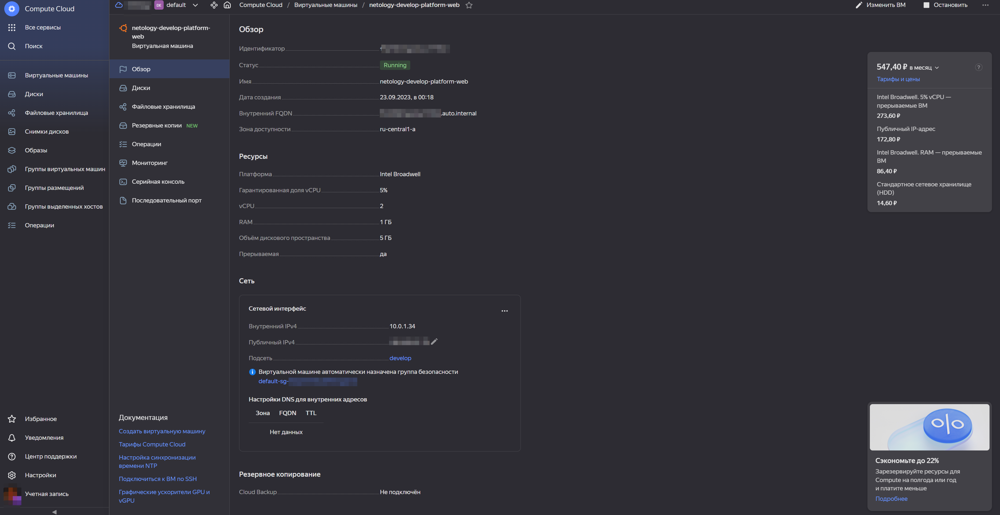
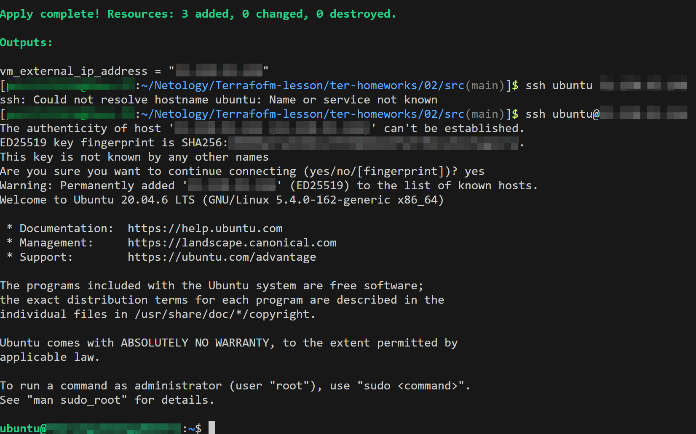

[Задание](https://github.com/netology-code/ter-homeworks/blob/main/01/hw-01.md)

------

### Задание 1

<details><summary>Описание</summary>

В качестве ответа всегда полностью прикладывайте ваш terraform-код в git.

1. Изучите проект. В файле variables.tf объявлены переменные для Yandex provider.
2. Переименуйте файл personal.auto.tfvars_example в personal.auto.tfvars. Заполните переменные: идентификаторы облака, токен доступа. Благодаря .gitignore этот файл не попадёт в публичный репозиторий. **Вы можете выбрать иной способ безопасно передать секретные данные в terraform.**
3. Сгенерируйте или используйте свой текущий ssh-ключ. Запишите его открытую часть в переменную **vms_ssh_root_key**.
4. Инициализируйте проект, выполните код. Исправьте намеренно допущенные синтаксические ошибки. Ищите внимательно, посимвольно. Ответьте, в чём заключается их суть.
5. Ответьте, как в процессе обучения могут пригодиться параметры ```preemptible = true``` и ```core_fraction=5``` в параметрах ВМ. Ответ в документации Yandex Cloud.

В качестве решения приложите:

- скриншот ЛК Yandex Cloud с созданной ВМ;
- скриншот успешного подключения к консоли ВМ через ssh. К OS ubuntu необходимо подключаться под пользователем ubuntu: "ssh ubuntu@vm_ip_address";
- ответы на вопросы.

</details>

**Ответ:**

<details><summary>Скриншот ЛК Yandex Cloud с созданной ВМ:</summary>



</details>

<details><summary>Скриншот успешного подключения к консоли ВМ через ssh:</summary>



</details>

Исправлены ошибки:
* стр. 17 - заменил `standart-v4` на `standard-v1`, т.к., во-первых, согласно [документации на платформы](https://cloud.yandex.ru/docs/compute/concepts/vm-platforms) нет платформы v4, а во-вторых допущена ошибка в standar**t** - на конце должна быть **d**.
* стр. 19 - заменил `cores         = 1`  на `cores         = 2`, т.к., согласно [документации на производительность платформ](https://cloud.yandex.ru/docs/compute/concepts/performance-levels) у платформы `standard-v1` минимальное значение - 2 vcpu

*Как в процессе обучения могут пригодиться параметры `preemptible = true` и `core_fraction=5`*
- `preemptible = true` - машина может остановиться, если прошло 24 часа с момента запуска или возникнет нехватка ресурсов в той же зоне доступности. Помогает сэкономить бюджет, т.к. машина остановится даже если забыл её выключить/уничтожить + такая машина обходится дешевле.
- `core_fraction=5` - при уровне производительности 5% ВМ будет иметь доступ к физическим ядрам как минимум 5% времени. Опять же, значительно экономит бюджет, т.к. для учебного проекта нет необходимости в постоянных вычислениях.

---

### Задание 4

<details><summary>Описание</summary>


1. Объявите в файле outputs.tf output типа map, содержащий { instance_name = external_ip } для каждой из ВМ.
2. Примените изменения.

В качестве решения приложите вывод значений ip-адресов команды ```terraform output```.

</details>

**Ответ:**

```terraform
~/Netology/Terrafofm-lesson/ter-homeworks/02/src(main)]$ terraform output
db_external_ip_address = "51.250.72.129"
web_external_ip_address = "158.160.57.187"
```

------

### Задание 7*

Изучите содержимое файла console.tf. Откройте terraform console, выполните следующие задания: 

1. Напишите, какой командой можно отобразить **второй** элемент списка test_list.

**Ответ:**

```terraform
> local.test_list[1]
"staging"
```

2. Найдите длину списка test_list с помощью функции length(<имя переменной>).

**Ответ:**
```terraform
> length (local.test_list)
3
```

3. Напишите, какой командой можно отобразить значение ключа admin из map test_map.

**Ответ:**
```terraform
> local.test_map.admin
"John"
OR
> local.test_map["admin"]
"John"
```

4. Напишите interpolation-выражение, результатом которого будет: "John is admin for production server based on OS ubuntu-20-04 with X vcpu, Y ram and Z virtual disks", используйте данные из переменных test_list, test_map, servers и функцию length() для подстановки значений.

**Ответ:**
```terraform
> "${local.test_map["admin"]} is admin for ${local.test_list[2]} server based on OS ${local.servers.production.image} with ${local.servers.production.cpu} vcpu, ${local.servers.production.ram} ram and ${length(local.servers.production.disks)} virtual disks"
"John is admin for production server based on OS ubuntu-20-04 with 10 vcpu, 40 ram and 4 virtual disks"
```