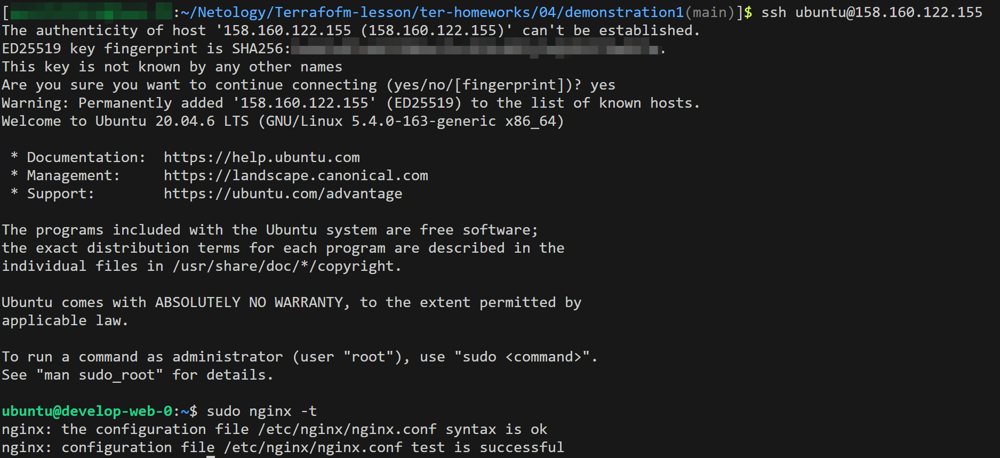
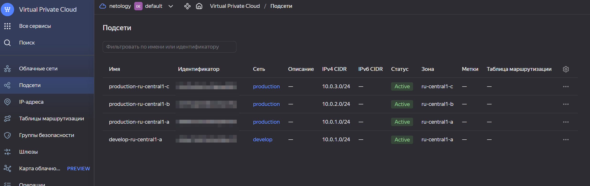
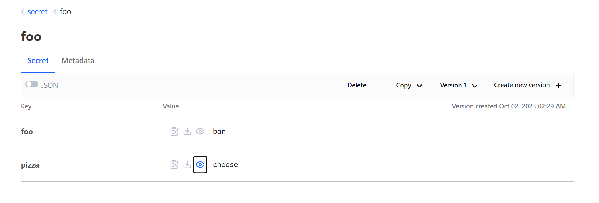

[Задание](https://github.com/netology-code/ter-homeworks/blob/main/04/hw-04.md)

------

### Задание 1

<details><summary>Описание</summary>

1. Возьмите из [демонстрации к лекции готовый код](https://github.com/netology-code/ter-homeworks/tree/main/04/demonstration1) для создания ВМ с помощью remote-модуля.
2. Создайте одну ВМ, используя этот модуль. В файле cloud-init.yml необходимо использовать переменную для ssh-ключа вместо хардкода. Передайте ssh-ключ в функцию template_file в блоке vars ={} .
Воспользуйтесь [**примером**](https://grantorchard.com/dynamic-cloudinit-content-with-terraform-file-templates/). Обратите внимание, что ssh-authorized-keys принимает в себя список, а не строку.
3. Добавьте в файл cloud-init.yml установку nginx.
4. Предоставьте скриншот подключения к консоли и вывод команды ```sudo nginx -t```.

</details>

**Ответ:**

<details><summary>1.2.-1.3. Изменённый файл cloud-init.yml</summary>

```yaml
#cloud-config
users:
  - name: ubuntu
    groups: sudo
    shell: /bin/bash
    sudo: ["ALL=(ALL) NOPASSWD:ALL"]
# 1.2. Используем переменную вместо хардкода
    ssh_authorized_keys:
      - ${ssh_public_key}
package_update: true
package_upgrade: false
packages:
  - vim
# 1.3. Добавляем nginx 
  - nginx
```

</details>

<details><summary>1.4. Скриншот подключения</summary>



</details>

------

### Задание 2

<details><summary>Описание</summary>

1. Напишите локальный модуль vpc, который будет создавать 2 ресурса: **одну** сеть и **одну** подсеть в зоне, объявленной при вызове модуля, например: ```ru-central1-a```.
2. Вы должны передать в модуль переменные с названием сети, zone и v4_cidr_blocks.
3. Модуль должен возвращать в root module с помощью output информацию о yandex_vpc_subnet. Пришлите скриншот информации из terraform console о своем модуле. Пример: > module.vpc_dev  
4. Замените ресурсы yandex_vpc_network и yandex_vpc_subnet созданным модулем. Не забудьте передать необходимые параметры сети из модуля vpc в модуль с виртуальной машиной.
5. Откройте terraform console и предоставьте скриншот содержимого модуля. Пример: > module.vpc_dev.
6. Сгенерируйте документацию к модулю с помощью terraform-docs.    
 
Пример вызова

```
module "vpc_dev" {
  source       = "./vpc"
  env_name     = "develop"
  zone = "ru-central1-a"
  cidr = "10.0.1.0/24"
}
```

</details>

**Ответ:**

<details><summary>> module.vpc_dev</summary>

```terraform
{
  "vpc_network_id" = "enpmq4dr14ive32f9acq"
  "vpc_network_name" = "develop"
  "vpc_subnet_cidr" = tolist([
    "10.0.1.0/24",
  ])
  "vpc_subnet_id" = "e9brfuftvo8u4q658gf0"
  "vpc_subnet_name" = "develop"
  "vpc_zone" = "ru-central1-a"
}
```

</details>

<details><summary>Документация к модулю vpc_dev</summary>

```terraform
terraform-docs markdown --output-file Readme.md ./vpc_dev
```

<!-- BEGIN_TF_DOCS -->
## Requirements

| Name | Version |
|------|---------|
| <a name="requirement_terraform"></a> [terraform](#requirement\_terraform) | >= 0.13 |

## Providers

| Name | Version |
|------|---------|
| <a name="provider_yandex"></a> [yandex](#provider\_yandex) | n/a |

## Modules

No modules.

## Resources

| Name | Type |
|------|------|
| [yandex_vpc_network.develop](https://registry.terraform.io/providers/yandex-cloud/yandex/latest/docs/resources/vpc_network) | resource |
| [yandex_vpc_subnet.develop](https://registry.terraform.io/providers/yandex-cloud/yandex/latest/docs/resources/vpc_subnet) | resource |

## Inputs

| Name | Description | Type | Default | Required |
|------|-------------|------|---------|:--------:|
| <a name="input_cidr"></a> [cidr](#input\_cidr) | https://cloud.yandex.ru/docs/vpc/operations/subnet-create | `list(string)` | <pre>[<br>  "10.0.1.0/24"<br>]</pre> | no |
| <a name="input_env_name"></a> [env\_name](#input\_env\_name) | VPC network&subnet name | `string` | `"develop"` | no |
| <a name="input_zone"></a> [zone](#input\_zone) | https://cloud.yandex.ru/docs/overview/concepts/geo-scope | `string` | `"ru-central1-a"` | no |

## Outputs

| Name | Description |
|------|-------------|
| <a name="output_vpc_network_id"></a> [vpc\_network\_id](#output\_vpc\_network\_id) | n/a |
| <a name="output_vpc_network_name"></a> [vpc\_network\_name](#output\_vpc\_network\_name) | n/a |
| <a name="output_vpc_subnet_cidr"></a> [vpc\_subnet\_cidr](#output\_vpc\_subnet\_cidr) | n/a |
| <a name="output_vpc_subnet_id"></a> [vpc\_subnet\_id](#output\_vpc\_subnet\_id) | n/a |
| <a name="output_vpc_subnet_name"></a> [vpc\_subnet\_name](#output\_vpc\_subnet\_name) | n/a |
| <a name="output_vpc_zone"></a> [vpc\_zone](#output\_vpc\_zone) | n/a |
<!-- END_TF_DOCS -->

</details>

---

### Задание 3

<details><summary>Описание</summary>

1. Выведите список ресурсов в стейте.
2. Полностью удалите из стейта модуль vpc.
3. Полностью удалите из стейта модуль vm.
4. Импортируйте всё обратно. Проверьте terraform plan. Изменений быть не должно.
Приложите список выполненных команд и скриншоты процессы.

</details>

**Ответ:**

<details><summary>3.1. Cписок ресурсов в стейте.</summary>

```terraform
$ terraform state list
data.template_file.cloudinit
module.test-vm.data.yandex_compute_image.my_image
module.test-vm.yandex_compute_instance.vm[0]
module.vpc_dev.yandex_vpc_network.develop
module.vpc_dev.yandex_vpc_subnet.develop
```

</details>

<details><summary>3.2-3.3. Удалить модули из стейта.</summary>

Сначала запомним id всех модулей:

```terraform
$ terraform state show module.vpc_dev.yandex_vpc_subnet.develop | grep id
    id             = "e9bandv89otv3h95qpjf"
```

```terraform
$ terraform state show module.vpc_dev.yandex_vpc_network.develop | grep id
    id                        = "enpcf1a417rvq5en2iq9"
```

```terraform
$ terraform state show module.test-vm.yandex_compute_instance.vm[0] | grep id
    id                        = "fhm52758amudo6ir8mkb"
```

Теперь удаляем

```terraform
$ terraform state rm module.vpc_dev.yandex_vpc_subnet.develop module.vpc_dev.yandex_vpc_network.develop
Removed module.vpc_dev.yandex_vpc_subnet.develop
Removed module.vpc_dev.yandex_vpc_network.develop
Successfully removed 2 resource instance(s).

$ terraform state rm module.test-vm.yandex_compute_instance.vm[0]
Removed module.test-vm.yandex_compute_instance.vm[0]
Successfully removed 1 resource instance(s).
```

</details>

<details><summary>3.4. Импортировать всё обратно.</summary>

```terraform
$ terraform import 'module.test-vm.yandex_compute_instance.vm[0]' fhm52758amudo6ir8mkb
$ terraform import 'module.vpc_dev.yandex_vpc_subnet.develop' e9bandv89otv3h95qpjf
$ terraform import 'module.vpc_dev.yandex_vpc_network.develop' enpcf1a417rvq5en2iq9
```

В плане всё таки есть элементы, подлежащие изменению:

```terraform
$ terraform plan
data.template_file.cloudinit: Reading...
module.test-vm.data.yandex_compute_image.my_image: Reading...
module.vpc_dev.yandex_vpc_network.develop: Refreshing state... [id=enpcf1a417rvq5en2iq9]
data.template_file.cloudinit: Read complete after 0s [id=91b26504d63395d9bb30260027e7447e1b1f9238aefaeb3b72e3314b8df35c5f]
module.test-vm.data.yandex_compute_image.my_image: Read complete after 0s [id=fd8o6khjbdv3f1suqf69]
module.vpc_dev.yandex_vpc_subnet.develop: Refreshing state... [id=e9bandv89otv3h95qpjf]
module.test-vm.yandex_compute_instance.vm[0]: Refreshing state... [id=fhm52758amudo6ir8mkb]

Terraform used the selected providers to generate the following execution plan. Resource actions are indicated with the following
symbols:
  ~ update in-place

Terraform will perform the following actions:

  # module.test-vm.yandex_compute_instance.vm[0] will be updated in-place
  ~ resource "yandex_compute_instance" "vm" {
      + allow_stopping_for_update = true
        id                        = "fhm52758amudo6ir8mkb"
        name                      = "develop-web-0"
        # (11 unchanged attributes hidden)

      - timeouts {}

        # (6 unchanged blocks hidden)
    }

Plan: 0 to add, 1 to change, 0 to destroy.
╷
│ Warning: Version constraints inside provider configuration blocks are deprecated
│ 
│   on .terraform/modules/test-vm/providers.tf line 2, in provider "template":
│    2:   version = "2.2.0"
│ 
│ Terraform 0.13 and earlier allowed provider version constraints inside the provider configuration block, but that is now
│ deprecated and will be removed in a future version of Terraform. To silence this warning, move the provider version constraint
│ into the required_providers block.
```

</details>

---

### Задание 4*

<details><summary>Описание:</summary>

1. Измените модуль vpc так, чтобы он мог создать подсети во всех зонах доступности, переданных в переменной типа list(object) при вызове модуля.  
  
Пример вызова
```
module "vpc_prod" {
  source       = "./vpc"
  env_name     = "production"
  subnets = [
    { zone = "ru-central1-a", cidr = "10.0.1.0/24" },
    { zone = "ru-central1-b", cidr = "10.0.2.0/24" },
    { zone = "ru-central1-c", cidr = "10.0.3.0/24" },
  ]
}

module "vpc_dev" {
  source       = "./vpc"
  env_name     = "develop"
  subnets = [
    { zone = "ru-central1-a", cidr = "10.0.1.0/24" },
  ]
}
```

Предоставьте код, план выполнения, результат из консоли YC.

</details>

**Ответ:**

[Код (vpc-main.tf)](./src/vpc/main.tf)

<details><summary>План выполнения:</summary>

```terraform
$ terraform plan
data.template_file.cloudinit: Reading...
data.template_file.cloudinit: Read complete after 0s [id=91b26504d63395d9bb30260027e7447e1b1f9238aefaeb3b72e3314b8df35c5f]
module.test-vm.data.yandex_compute_image.my_image: Reading...
module.test-vm.data.yandex_compute_image.my_image: Read complete after 0s [id=fd8o6khjbdv3f1suqf69]

Terraform used the selected providers to generate the following execution plan. Resource actions are indicated with the following
symbols:
  + create

Terraform will perform the following actions:

  # module.test-vm.yandex_compute_instance.vm[0] will be created
  + resource "yandex_compute_instance" "vm" {
      + allow_stopping_for_update = true
      + created_at                = (known after apply)
      + description               = "TODO: description; {{terraform managed}}"
      + folder_id                 = (known after apply)
      + fqdn                      = (known after apply)
      + gpu_cluster_id            = (known after apply)
      + hostname                  = "develop-web-0"
      + id                        = (known after apply)
      + labels                    = {
          + "env"     = "develop"
          + "project" = "undefined"
        }
      + metadata                  = {
          + "serial-port-enable" = "1"
          + "user-data"          = <<-EOT
                #cloud-config
                users:
                  - name: ubuntu
                    groups: sudo
                    shell: /bin/bash
                    sudo: ["ALL=(ALL) NOPASSWD:ALL"]
                    ssh_authorized_keys:
                      - ssh-ed25519 AAAAC3NzaC1lZDI1NTE5AAAAIOZg2+u0uMeAskVRWa8dtvT8wO8Qydp+x+7A0Hd6+gWJ pozitiff4ik@Zoon-PC
                
                package_update: true
                package_upgrade: false
                packages:
                  - vim
                  - nginx
            EOT
        }
      + name                      = "develop-web-0"
      + network_acceleration_type = "standard"
      + platform_id               = "standard-v1"
      + service_account_id        = (known after apply)
      + status                    = (known after apply)
      + zone                      = "ru-central1-a"

      + boot_disk {
          + auto_delete = true
          + device_name = (known after apply)
          + disk_id     = (known after apply)
          + mode        = (known after apply)

          + initialize_params {
              + block_size  = (known after apply)
              + description = (known after apply)
              + image_id    = "fd8o6khjbdv3f1suqf69"
              + name        = (known after apply)
              + size        = 10
              + snapshot_id = (known after apply)
              + type        = "network-hdd"
            }
        }

      + network_interface {
          + index              = (known after apply)
          + ip_address         = (known after apply)
          + ipv4               = true
          + ipv6               = (known after apply)
          + ipv6_address       = (known after apply)
          + mac_address        = (known after apply)
          + nat                = true
          + nat_ip_address     = (known after apply)
          + nat_ip_version     = (known after apply)
          + security_group_ids = (known after apply)
          + subnet_id          = (known after apply)
        }

      + resources {
          + core_fraction = 5
          + cores         = 2
          + memory        = 1
        }

      + scheduling_policy {
          + preemptible = true
        }
    }

  # module.vpc_dev.yandex_vpc_network.network will be created
  + resource "yandex_vpc_network" "network" {
      + created_at                = (known after apply)
      + default_security_group_id = (known after apply)
      + folder_id                 = (known after apply)
      + id                        = (known after apply)
      + labels                    = (known after apply)
      + name                      = "develop"
      + subnet_ids                = (known after apply)
    }

  # module.vpc_dev.yandex_vpc_subnet.subnet["0"] will be created
  + resource "yandex_vpc_subnet" "subnet" {
      + created_at     = (known after apply)
      + folder_id      = (known after apply)
      + id             = (known after apply)
      + labels         = (known after apply)
      + name           = "develop-ru-central1-a"
      + network_id     = (known after apply)
      + v4_cidr_blocks = [
          + "10.0.1.0/24",
        ]
      + v6_cidr_blocks = (known after apply)
      + zone           = "ru-central1-a"
    }

  # module.vpc_prod.yandex_vpc_network.network will be created
  + resource "yandex_vpc_network" "network" {
      + created_at                = (known after apply)
      + default_security_group_id = (known after apply)
      + folder_id                 = (known after apply)
      + id                        = (known after apply)
      + labels                    = (known after apply)
      + name                      = "production"
      + subnet_ids                = (known after apply)
    }

  # module.vpc_prod.yandex_vpc_subnet.subnet["0"] will be created
  + resource "yandex_vpc_subnet" "subnet" {
      + created_at     = (known after apply)
      + folder_id      = (known after apply)
      + id             = (known after apply)
      + labels         = (known after apply)
      + name           = "production-ru-central1-a"
      + network_id     = (known after apply)
      + v4_cidr_blocks = [
          + "10.0.1.0/24",
        ]
      + v6_cidr_blocks = (known after apply)
      + zone           = "ru-central1-a"
    }

  # module.vpc_prod.yandex_vpc_subnet.subnet["1"] will be created
  + resource "yandex_vpc_subnet" "subnet" {
      + created_at     = (known after apply)
      + folder_id      = (known after apply)
      + id             = (known after apply)
      + labels         = (known after apply)
      + name           = "production-ru-central1-b"
      + network_id     = (known after apply)
      + v4_cidr_blocks = [
          + "10.0.2.0/24",
        ]
      + v6_cidr_blocks = (known after apply)
      + zone           = "ru-central1-b"
    }

  # module.vpc_prod.yandex_vpc_subnet.subnet["2"] will be created
  + resource "yandex_vpc_subnet" "subnet" {
      + created_at     = (known after apply)
      + folder_id      = (known after apply)
      + id             = (known after apply)
      + labels         = (known after apply)
      + name           = "production-ru-central1-c"
      + network_id     = (known after apply)
      + v4_cidr_blocks = [
          + "10.0.3.0/24",
        ]
      + v6_cidr_blocks = (known after apply)
      + zone           = "ru-central1-c"
    }

Plan: 7 to add, 0 to change, 0 to destroy.

Changes to Outputs:
  + external_ip = [
      + (known after apply),
    ]
```

</details>

<details><summary>Результат в YC::</summary>



</details>

---

<details><summary>Задание 5, которе я не выполнил</summary>

### Задание 5*

1. Напишите модуль для создания кластера managed БД Mysql в Yandex Cloud с одним или тремя хостами в зависимости от переменной HA=true или HA=false. Используйте ресурс yandex_mdb_mysql_cluster: передайте имя кластера и id сети.
2. Напишите модуль для создания базы данных и пользователя в уже существующем кластере managed БД Mysql. Используйте ресурсы yandex_mdb_mysql_database и yandex_mdb_mysql_user: передайте имя базы данных, имя пользователя и id кластера при вызове модуля.
3. Используя оба модуля, создайте кластер example из одного хоста, а затем добавьте в него БД test и пользователя app. Затем измените переменную и превратите сингл хост в кластер из 2-х серверов.
4. Предоставьте план выполнения и по возможности результат. Сразу же удаляйте созданные ресурсы, так как кластер может стоить очень дорого. Используйте минимальную конфигурацию.

</details>

---

### Задание 6*

<details><summary>Описание:</summary>

1. Разверните у себя локально vault, используя docker-compose.yml в проекте.
2. Для входа в web-интерфейс и авторизации terraform в vault используйте токен "education".
3. Создайте новый секрет по пути http://127.0.0.1:8200/ui/vault/secrets/secret/create
Path: example  
secret data key: test 
secret data value: congrats!  
4. Считайте этот секрет с помощью terraform и выведите его в output по примеру:
```
provider "vault" {
 address = "http://<IP_ADDRESS>:<PORT_NUMBER>"
 skip_tls_verify = true
 token = "education"
}
data "vault_generic_secret" "vault_example"{
 path = "secret/example"
}

output "vault_example" {
 value = "${nonsensitive(data.vault_generic_secret.vault_example.data)}"
} 

Можно обратиться не к словарю, а конкретному ключу:
terraform console: >nonsensitive(data.vault_generic_secret.vault_example.data.<имя ключа в секрете>)
```
5. Попробуйте самостоятельно разобраться в документации и записать новый секрет в vault с помощью terraform. 

</details>

**Ответ:**

<details><summary>6.4. Вывести ключ</summary>

Пробуем вывести простой командой:
```terraform
> data.vault_generic_secret.vault_example
{
  "data" = (sensitive value)
  "data_json" = (sensitive value)
  "id" = "secret/example"
  "lease_duration" = 0
  "lease_id" = ""
  "lease_renewable" = false
  "lease_start_time" = "2023-10-01T23:16:07Z"
  "namespace" = tostring(null)
  "path" = "secret/example"
  "version" = -1
  "with_lease_start_time" = true
}
```

Добавляем `nonsensitive`, чтобы получить `sensitive`-данные, Обращаемся к конкретному ключу:
```terraform
> nonsensitive(data.vault_generic_secret.vault_example.data)
tomap({
  "test" = "congrats!"
})

> nonsensitive(data.vault_generic_secret.vault_example.data).test
"congrats!"
```
</details>

<details><summary>6.5. Добавить новый ключ через terraform:</summary>

```terraform
resource "vault_generic_secret" "key" {
  path = "secret/foo"

  data_json = <<EOT
{
  "foo":   "bar",
  "pizza": "cheese"
}
EOT
}
```

Результат:

</details>

---