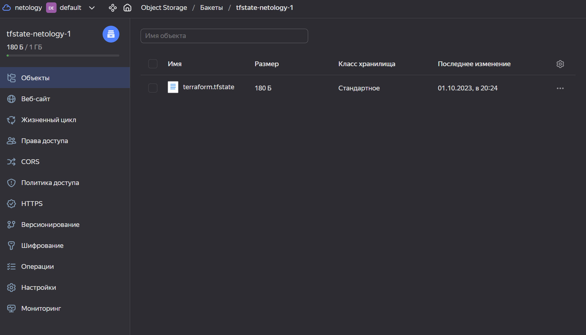
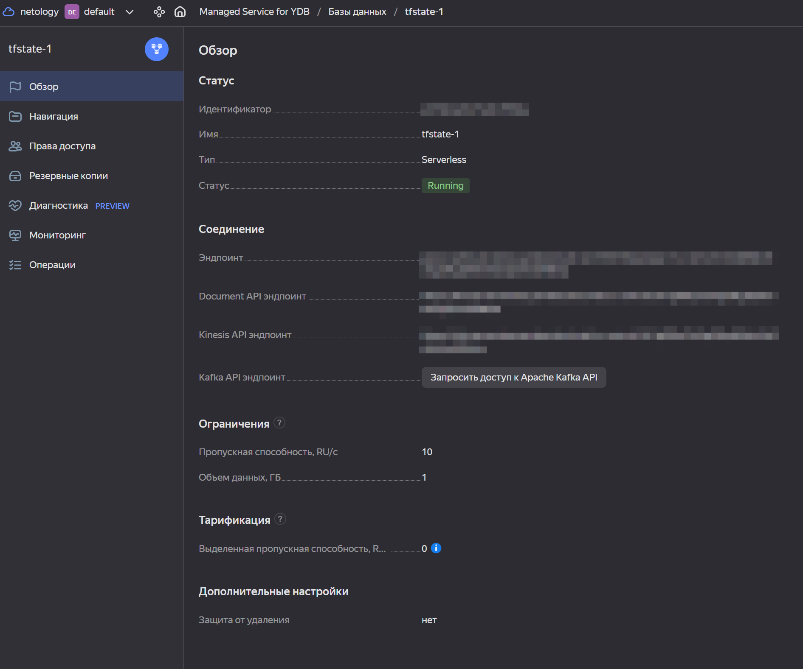
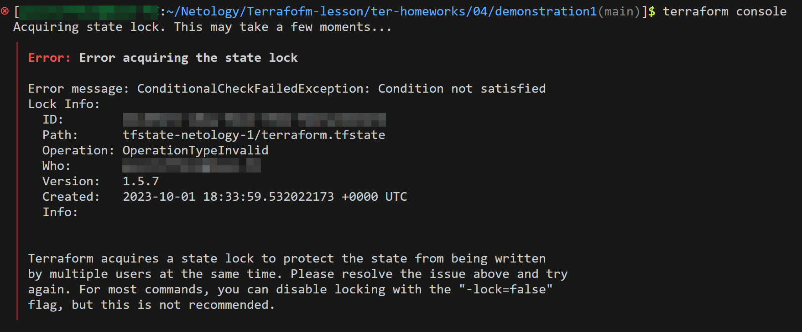
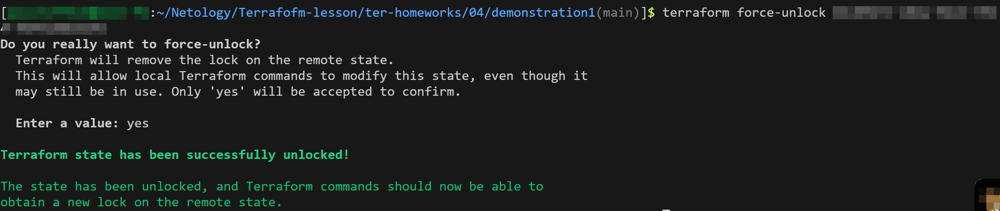

[Задание](https://github.com/netology-code/ter-homeworks/blob/4aaee6bb9ca27433c8916c10f1d1ab1bda45b455/05/hw-05.md)

---

### Задание 1

<details><summary>Описание</summary>

1. Возьмите код:
- из [ДЗ к лекции 4](https://github.com/netology-code/ter-homeworks/tree/main/04/src),
- из [демо к лекции 4](https://github.com/netology-code/ter-homeworks/tree/main/04/demonstration1).
2. Проверьте код с помощью tflint и checkov. Вам не нужно инициализировать этот проект.
3. Перечислите, какие **типы** ошибок обнаружены в проекте (без дублей).

</details>

**Ответ:**

<details><summary>TFLint</summary>

Директива `FILE/DIR` устарела и будет удалена в следующих версиях, используйте вместо неё `--chdir` или `--filter`:
> WARNING: "tflint FILE/DIR" is deprecated and will error in a future version. Use --chdir or --filter instead.
3 issue(s) found:

Пропущено указание ограничения версии ресурса для провайдера `template`. Может привести к нежелательным изменениям, вплоть до невалидности кода:
> Warning: Missing version constraint for provider "template" in "required_providers" (terraform_required_providers)
> 
>   on tflint/main.tf line 38:
>   38: data "template_file" "cloudinit" {
> 
> Reference: https://github.com/terraform-linters/tflint-ruleset-terraform/blob/v0.2.2/docs/rules/terraform_required_providers.md


Источник в модуле указан с использованием основной ветки, без указания версии. Может привести к незапланированным изменениям в конфигурации:
> Warning: Module source "git::https://github.com/udjin10/yandex_compute_instance.git?ref=main" uses a default branch as ref (main) (terraform_module_pinned_source)
> 
>   on tflint/main.tf line 21:
>   21:   source       = "git::https://github.com/udjin10/yandex_compute_instance.git?ref=main"
> 
> Reference: https://github.com/terraform-linters/tflint-ruleset-terraform/blob/v0.2.2/docs/rules/terraform_module_pinned_source.md

</details>

<details><summary>Checkov</summary>

Сетевой интерфейс не привязан к какой-либо `security group`:
> Check: CKV_YC_11: "Ensure security group is assigned to network interface."
> 
>        FAILED for resource: module.test-vm.yandex_compute_instance.vm[0]
>        File: /.external_modules/github.com/udjin10/yandex_compute_instance/95c286e0062805d5ba5edb866f387247bc1bbd44/main.tf:24-73
>        Calling File: /main.tf:20-36
>
>    Code lines for this resource are too many. Please use IDE of your choice to review the file.

Инстанс использует публичный IP:
> Check: CKV_YC_2: "Ensure compute instance does not have public IP."
> 
>         FAILED for resource: module.test-vm.yandex_compute_instance.vm[0]
>         File: /.external_modules/github.com/udjin10/yandex_compute_instance/95c286e0062805d5ba5edb866f387247bc1bbd44/main.tf:24-73
>         Calling File: /main.tf:20-36
> 
>    Code lines for this resource are too many. Please use IDE of your choice to review the file.

Та же, что в TFLint - в источнике для модуля используется основная ветка, а не конкретный коммит:
> Check: CKV_TF_1: "Ensure Terraform module sources use a commit hash"
> 
>         FAILED for resource: test-vm
>         File: /main.tf:20-36
>         Guide: https://docs.paloaltonetworks.com/content/techdocs/en_US/prisma/prisma-cloud/prisma-cloud-code-security-policy-reference/supply-chain-policies/terraform-policies/ensure-terraform-module-sources-use-git-url-with-commit-hash-revision.html
> 
>                 20 | module "test-vm" {
>                 21 |   source       = "git::https://github.com/udjin10/yandex_compute_instance.git?ref=main"
>                 ....
>                 36 | }

</details>

------

### Задание 2

<details><summary>Описание</summary>

1. Возьмите ваш GitHub-репозиторий с **выполненным ДЗ 4** в ветке 'terraform-04' и сделайте из него ветку 'terraform-05'.
2. Повторите демонстрацию лекции: настройте YDB, S3 bucket, yandex service account, права доступа и мигрируйте state проекта в S3 с блокировками. Предоставьте скриншоты процесса в качестве ответа.
3. Закоммитьте в ветку 'terraform-05' все изменения.
4. Откройте в проекте terraform console, а в другом окне из этой же директории попробуйте запустить terraform apply.
5. Пришлите ответ об ошибке доступа к state.
6. Принудительно разблокируйте state. Пришлите команду и вывод.

</details>

**Ответ:**

<details><summary>2.2. Скриншоты</summary>

Бакет


YDB


Пробуем подключиться к консоли terraform при уже занятом в другой сессии стейте:


Принудительно разблокируем стейт командой `terraform force-unlock id`, id берём из информации об ошибке:


</details>

------
### Задание 3  

1. Сделайте в GitHub из ветки 'terraform-05' новую ветку 'terraform-hotfix'.
2. Проверье код с помощью tflint и checkov, исправьте все предупреждения и ошибки в 'terraform-hotfix', сделайте коммит.
3. Откройте новый pull request 'terraform-hotfix' --> 'terraform-05'. 
4. Вставьте в комментарий PR результат анализа tflint и checkov, план изменений инфраструктуры из вывода команды terraform plan.
5. Пришлите ссылку на PR для ревью. Вливать код в 'terraform-05' не нужно.

<details><summary>3.2. Что сделал</summary>

- добавил ограничение версий для провайдеров yandex и template
- указал конкретный коммит в качестве источника для удалённого модуля
- убрал nat
- добавил security group по примеру из [ДЗ 7-3](https://github.com/P0zitiff4ik/devops-netology/blob/terraform-05/ter-homeworks/07-terraform-03-control-structures/src/security.tf)

```terraform
terraform {
  required_providers {
    yandex = {
      source  = "yandex-cloud/yandex"
      version = ">=0.99"
    }
    template = {
      version = "~> 2.0"
      
module "test-vm" {
  source             = "git::https://github.com/udjin10/yandex_compute_instance.git?ref=95c286e0062805d5ba5edb866f387247bc1bbd44"
  public_ip          = false
  security_group_ids = [yandex_vpc_security_group.example.id]
```

</details>

------
### Задание 4

1. Напишите переменные с валидацией и протестируйте их, заполнив default верными и неверными значениями. Предоставьте скриншоты проверок из terraform console. 

- type=string, description="ip-адрес" — проверка, что значение переменной содержит верный IP-адрес с помощью функций cidrhost() или regex(). Тесты:  "192.168.0.1" и "1920.1680.0.1";
- type=list(string), description="список ip-адресов" — проверка, что все адреса верны. Тесты:  ["192.168.0.1", "1.1.1.1", "127.0.0.1"] и ["192.168.0.1", "1.1.1.1", "1270.0.0.1"].

## Дополнительные задания (со звёздочкой*)

**Настоятельно рекомендуем выполнять все задания со звёздочкой.** Их выполнение поможет глубже разобраться в материале.   
Задания со звёздочкой дополнительные, не обязательные к выполнению и никак не повлияют на получение вами зачёта по этому домашнему заданию. 
------
### Задание 5*
1. Напишите переменные с валидацией:
- type=string, description="любая строка" — проверка, что строка не содержит символов верхнего регистра;
- type=object — проверка, что одно из значений равно true, а второе false, т. е. не допускается false false и true true:
```
variable "in_the_end_there_can_be_only_one" {
    description="Who is better Connor or Duncan?"
    type = object({
        Dunkan = optional(bool)
        Connor = optional(bool)
    })

    default = {
        Dunkan = true
        Connor = false
    }

    validation {
        error_message = "There can be only one MacLeod"
        condition = <проверка>
    }
}
```
------
### Задание 6*

1. Настройте любую известную вам CI/CD-систему. Если вы ещё не знакомы с CI/CD-системами, настоятельно рекомендуем вернуться к этому заданию после изучения Jenkins/Teamcity/Gitlab.
2. Скачайте с её помощью ваш репозиторий с кодом и инициализируйте инфраструктуру.
3. Уничтожьте инфраструктуру тем же способом.

