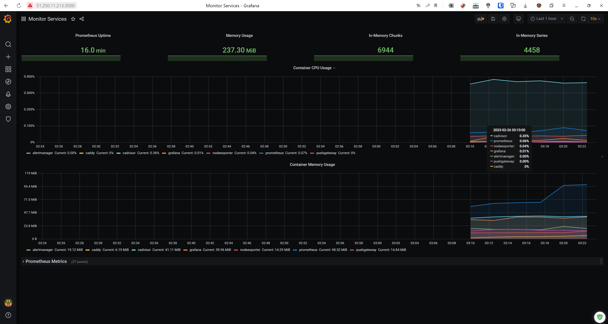

[Задание](https://github.com/netology-code/virt-homeworks/blob/virt-11/05-virt-04-docker-compose/README.md)

------

### 1. Создать собственный образ любой операционной системы (например, ubuntu-20.04) с помощью Packer


---

### 2. Создать вашу первую виртуальную машину в YandexCloud с помощью terraform

```terraform
$ terraform apply

Terraform used the selected providers to generate the following execution plan. Resource actions are indicated with the following
symbols:
  + create

Terraform will perform the following actions:

  # yandex_compute_instance.node01 will be created
  + resource "yandex_compute_instance" "node01" {
      + allow_stopping_for_update = true
      + created_at                = (known after apply)
      + folder_id                 = (known after apply)
      + fqdn                      = (known after apply)
      + hostname                  = "node01.netology.cloud"
      + id                        = (known after apply)
      + metadata                  = {
          + "ssh-keys" = <<-EOT
                centos:ssh-rsa <my-ssh-key.pub>
            EOT
        }
      + name                      = "node01"
      + network_acceleration_type = "standard"
      + platform_id               = "standard-v1"
      + service_account_id        = (known after apply)
      + status                    = (known after apply)
      + zone                      = "ru-central1-a"

      + boot_disk {
          + auto_delete = true
          + device_name = (known after apply)
          + disk_id     = (known after apply)
          + mode        = (known after apply)

          + initialize_params {
              + block_size  = (known after apply)
              + description = (known after apply)
              + image_id    = "fd8vil2gf14qli467ovs"
              + name        = "root-node01"
              + size        = 50
              + snapshot_id = (known after apply)
              + type        = "network-nvme"
            }
        }

      + metadata_options {
          + aws_v1_http_endpoint = (known after apply)
          + aws_v1_http_token    = (known after apply)
          + gce_http_endpoint    = (known after apply)
          + gce_http_token       = (known after apply)
        }

      + network_interface {
          + index              = (known after apply)
          + ip_address         = (known after apply)
          + ipv4               = true
          + ipv6               = (known after apply)
          + ipv6_address       = (known after apply)
          + mac_address        = (known after apply)
          + nat                = true
          + nat_ip_address     = (known after apply)
          + nat_ip_version     = (known after apply)
          + security_group_ids = (known after apply)
          + subnet_id          = (known after apply)
        }

      + placement_policy {
          + host_affinity_rules = (known after apply)
          + placement_group_id  = (known after apply)
        }

      + resources {
          + core_fraction = 100
          + cores         = 8
          + memory        = 8
        }

      + scheduling_policy {
          + preemptible = (known after apply)
        }
    }

  # yandex_vpc_network.default will be created
  + resource "yandex_vpc_network" "default" {
      + created_at                = (known after apply)
      + default_security_group_id = (known after apply)
      + folder_id                 = (known after apply)
      + id                        = (known after apply)
      + labels                    = (known after apply)
      + name                      = "net"
      + subnet_ids                = (known after apply)
    }

  # yandex_vpc_subnet.default will be created
  + resource "yandex_vpc_subnet" "default" {
      + created_at     = (known after apply)
      + folder_id      = (known after apply)
      + id             = (known after apply)
      + labels         = (known after apply)
      + name           = "subnet"
      + network_id     = (known after apply)
      + v4_cidr_blocks = [
          + "192.168.101.0/24",
        ]
      + v6_cidr_blocks = (known after apply)
      + zone           = "ru-central1-a"
    }

Plan: 3 to add, 0 to change, 0 to destroy.

Changes to Outputs:
  + external_ip_address_node01_yandex_cloud = (known after apply)
  + internal_ip_address_node01_yandex_cloud = (known after apply)

Do you want to perform these actions?
  Terraform will perform the actions described above.
  Only 'yes' will be accepted to approve.

  Enter a value: yes

yandex_vpc_network.default: Creating...
yandex_vpc_network.default: Creation complete after 3s [id=enp7hq4nab85bkei8vpj]
yandex_vpc_subnet.default: Creating...
yandex_vpc_subnet.default: Creation complete after 0s [id=e9be1qlbls5fqvhutrju]
yandex_compute_instance.node01: Creating...
yandex_compute_instance.node01: Still creating... [10s elapsed]
yandex_compute_instance.node01: Still creating... [20s elapsed]
yandex_compute_instance.node01: Still creating... [30s elapsed]
yandex_compute_instance.node01: Still creating... [40s elapsed]
yandex_compute_instance.node01: Still creating... [50s elapsed]
yandex_compute_instance.node01: Creation complete after 54s [id=fhmj89m8q89g9k5rtvr4]

Apply complete! Resources: 3 added, 0 changed, 0 destroyed.

Outputs:

external_ip_address_node01_yandex_cloud = "51.250.11.213"
internal_ip_address_node01_yandex_cloud = "192.168.101.11"
```


---

### 3. С помощью ansible и docker-compose разверните на виртуальной машине из предыдущего задания систему мониторинга на основе Prometheus/Grafana

```bash
[root@node01 ~]# docker ps
CONTAINER ID   IMAGE                              COMMAND                  CREATED         STATUS                        PORTS                                                                              NAMES
d7851c6e2a90   stefanprodan/caddy                 "/sbin/tini -- caddy…"   2 minutes ago   Up About a minute             0.0.0.0:3000->3000/tcp, 0.0.0.0:9090-9091->9090-9091/tcp, 0.0.0.0:9093->9093/tcp   caddy
1f0d91b47800   gcr.io/cadvisor/cadvisor:v0.47.0   "/usr/bin/cadvisor -…"   2 minutes ago   Up About a minute (healthy)   8080/tcp                                                                           cadvisor
ed95ffc7a57a   prom/prometheus:v2.17.1            "/bin/prometheus --c…"   2 minutes ago   Up About a minute             9090/tcp                                                                           prometheus
8e686f21d3c6   prom/alertmanager:v0.20.0          "/bin/alertmanager -…"   2 minutes ago   Up About a minute             9093/tcp                                                                           alertmanager
2075c29e2b14   prom/pushgateway:v1.2.0            "/bin/pushgateway"       2 minutes ago   Up About a minute             9091/tcp                                                                           pushgateway
95950cb4dea1   prom/node-exporter:v0.18.1         "/bin/node_exporter …"   2 minutes ago   Up About a minute             9100/tcp                                                                           nodeexporter
1b0e138ba258   grafana/grafana:7.4.2              "/run.sh"                2 minutes ago   Up About a minute             3000/tcp                                                                           grafana
```

---

### 4. Скриншот работающего веб-интерфейса Grafana с текущими метриками



---

### 5. Создать вторую ВМ и подключить её к мониторингу развёрнутому на первом сервере